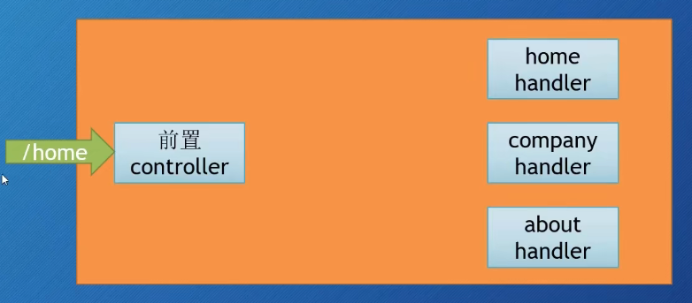

# Go Web 快速入门
# 介绍
来着b站软件工艺师视频教程

(Go Web 编程快速入门【Golang/Go语言】)[https://www.bilibili.com/video/BV1Xv411k7Xn?vd_source=917ef87e48a267f0acc88f766dea0a6e&spm_id_from=333.788.videopod.episodes]

## 小demo
仅用两行代码创建一个web
```go
func main() {
	// 调用适配器处理函数，两个参数，一个http地址，一个是hangler函数
	http.HandleFunc("/", func(w http.ResponseWriter, r *http.Request) {
		w.Write([]byte("hello go"))
	})

	//设置web 服务器,俩个参数，一个监听地址port,一个handler,默认是nil， 采用多路复用mux
	http.ListenAndServe("localhost:8080", nil)

}
```

## 处理handle请求
Handler处理进来的HTTP请求，go语言会创建一个goroutine

### http.ListenAndServe()
+ 第一个参数是网络地址
    + 如何为""，网络接口在80端口
+ 第二个参数是handler
    - 可以是nil，即DefaultServeMux

### DefaultServeMux
一个multiplexer 多路复用器，它也是一个Handler

```go
	http.ListenAndServe("localhost:8080", nil)
```

http.Server是一个struct，也可以自定义server，以下为常用的方法

```go
	server := http.Server{
		Addr: ("localhost:8080"),
		Handler: nil,
	}
	server.ListenAndServe()
```

### Handler
Handler是一个接口，定义了ServeHTTP方法

```go
type Handler interface {
    ServeHTTP(ResponseWriter, *Request)
}
```

也可自定义Handler，实现ServeHTTP方法

+ 多个Handler情况，处理不同的路径 http.Handle()
    + 调用http.Handler，实际上调用的是DefaultServeMux的Handle方法 

#### 第一个函数http.Handle
```go
type helloHandler struct{}

func (h helloHandler) ServeHTTP(w http.ResponseWriter, r *http.Request) {
    w.Write([]byte("hello go"))
}

type aboutHandler struct{}

func (a aboutHandler) ServeHTTP(w http.ResponseWriter, r *http.Request) {
    w.Write([]byte("about go"))
}

func main() {
    mh := helloHandler{}
    ah := aboutHandler{}
    server := http.Server{
        Addr: ("localhost:8080"),
        Handler: nil,
    }
    http.Handle("/hello", &mh)
    http.Handle("/about", &ah)
    server.ListenAndServe()
}
```

#### 第二个函数http.HandleFunc

将某个具有适当签名的函数，适配成一个Handler，这个Handler具有方法

```go
func welcome(w http.ResponseWriter, r *http.Request) {
    w.Write([]byte("welcome to go web"))
}

func main(){
    http.HandleFunc("/home",func(w http.ResponseWriter, r *http.Request){
        w.Write([]byte("home page"))
    })
    http.HandlerFunc("/welcome", welcome)
    http.Handle("/welcome", http.HandlerFunc(welcome)) // http.HandlerFunc为一个函数结构，实现也是serveHTTP方法 符合Handler接口，即可以将Handler函数转化为Handler
}
```

## 内置的Handlers

### http.NotFoundHandler
+ 返回一个handler，每个请求响应都是"404 page not found"

### http.RedirectHandler
+ 返回一个handler，重定向到另一个URL，使用给定的状态码跳转

### http.StripPrefix
+ 返回一个handler，从请求URL中去掉指定的前缀，再调用另一个handler
    - 略像中间件
### http.TimeoutHandler
+ 返回一个handler，在指定时间内没有响应，则返回超时响应

### http.FileServer
+ 返回一个handler，提供文件服务，可以访问指定目录下的文件

#### 例子
+ http.ServeFile(w, r, "path/to/file")

```go
func main() {
    http.HandleFunc("/", func(w http.ResponseWriter, r *http.Request) {
        http.ServeFile(w, r, "path/to/file")
        http.ListenAndServe(":8080", nil)
    })
}
```

+ http.FileServer(http.Dir("path/to/directory"))

```go
func main() {
http.ListenAndServe(":8080", http.FileServer(http.Dir("path/to/directory")))
}
```

## Request 请求

### HTTP消息
1. 请求 HTTP Request
2. 响应 HTTP Response

它们具有相同的结构，请求（响应）行，0个或多个Header，一个空行，一个可选的Body

#### 请求 (Request)
+ Request是一个struct
    - URL
    - Header
    - Body
    - Form、PostForm、MultipartForm
+ Request可代表发送到服务器请求，也可表示客户端发出的请求

##### 请求的URL
+ URL字段表示请求信息的第一行里面的内容
+ URL字段指向url.URL类型的一个指针，url.URL是一个struct

+ 通用形式: scheme://host:port/path?query#fragment
    - RawQuery字段表示query部分，不包含问号
    - Fragment字段表示fragment部分，不包含井号。 从浏览器发出的请求，会把fragment部分去掉，无法提取Fragment字段

##### 请求的Header
headers字段是一个map[string][]string类型，表示HTTP请求的头部信息（Key-Value对）
```go
func main() {
    server := http.Server{
        Addr: "localhost:8080",
    }
    http.HandleFunc("/", func(w http.ResponseWriter, r *http.Request) {
        fmt.Fprintln(w, r.Header)
        fmt.Fprintln(w, r.Header["Accept-Encoding"])
        fmt.Fprintln(w, r.Header.Get("Accept-Encoding"))
    })
}
```

##### 请求的Body
请求和响应的Body字段都是io.ReadCloser类型，表示请求或响应的主体内容。
+ 一个Reader接口，Read方法
+ 一个Closer接口，用于关闭Body
```go
func main() {
    server := http.Server{
        Addr: "localhost:8080",
    }
    http.HandleFunc("/", func(w http.ResponseWriter, r *http.Request) {
        length:=r.ContentLength
        body := make([]byte, length)
        r.Body.Read(body)
        fmt.Fprintln(w, string(body))
    })
}
```

##### URL Query
r.URL.RawQuery字段表示URL的查询参数，提供实际查询的原始字符串
r.URL.Query()返回一个map[string][]string类型，表示URL的查询参数

响应: localhost:8080/home?id=123&name=Dave&id=456&name=John
```go
func main() {
    http.HandleFunc("/home", func(w http.ResponseWriter, r *http.Request) {
        url := r.URL
        query := url.Query()

        id := query["id"] // 返回字符串切片
        log.Println(id)

        name := query.Get("name") // get 取第一个query参数的值
        log.Println(name)
    })
    http.ListenAndServe(":8080", nil)
}
```

## Form表单
### 来自请求的Form表单

```html
<form action="/process" method="POST">
    <input type="text" name="name">
    <input type="submit" value="Submit">
</form>
```
这个html表单内的数据以name-value对形式，通过POST请求发送出去。数据内容在POST请求的Body里面

#### 表单Post请求的数据格式
+ 通过POST发送的name-value数据对的格式，可通过表单Content-Type头部来指定，即enctype属性的值
    + 常见的Content-Type值
        - application/x-www-form-urlencoded
        - multipart/form-data
        - text/plain
+ 如何选择
    - 对于简单的表单，使用application/x-www-form-urlencoded更方便
    - 对于大量数据，文件上传，使用multipart/form-data更方便

#### 表单的GET
+ method 属性，设置POST获知GET
+ GET请求没有body，所有数据通过URL的name-value对形式传递

### Form字段
Request上函数允许我们从URL或/和Body中提取数据，Form、PostForm、MultipartForm三个字段

Form里面都是key-value对

+ 先调用ParseForm()或ParseMultipartForm()方法，解析Form字段；然后访问Form、PostForm、MultipartForm字段

+ r.Form是map[string][]striing，key是string，值是slice

### PostForm字段
+ 如果表单和URL里有同样的key，会放在一个slice里，表单里的值靠前，URL里的值靠后
+ 如果只想要表单的key-value对，不需要URL，可以使用PostForm字段

PostForm只支持application/x-www-form-urlencoded

### MultipartForm字段
首先需要调用ParseMultipartForm()方法，解析multipart/form-data格式的数据，然后访问该字段

+ MultipartForm只包含表单里的key-value对

+ 返回类型是一个struct而不是map，这个struct包含两个map
    - key是string，value是[]string
    - 空（key是string，value是上传的文件）

### FormValue()和PostFormValue()
+ FormValue方法返回Form字段中指定key对应的第一个value
    - 无需调用ParseForm()或ParseMultipartForm()方法

+ PostFormValue方法返回PostForm字段中指定key对应的第一个value


### 上传文件
#### 方法一 multipart/form-data 最常见用来上传文件 

```go
func process(w http.ResponseWriter, r *http.Request) {
	r.ParseMultipartForm(1024)

	fileHeader := r.MultipartForm.File["uploaded"][0] // 获取上传的第一个文件
	file, err := fileHeader.Open()
	if err == nil {
		data, err := ioutil.ReadAll(file)
		if err == nil {
			fmt.Fprintln(w, string(data))
		}
	}
}
func main() {
	server := http.Server{
		Addr: "localhost:8080",
	}
	http.HandleFunc("/process", process)
	server.ListenAndServe()
}
```
+ 调用ParseMultipartForm()方法解析multipart/form-data格式的数据
+ 从File字段获得FileHeader，调用Open()方法打开文件
+ 可使用ioutil.ReadAll()方法读取文件内容，如读取到byte切片

#### 方法二 FormFile()

```go
func process(w http.ResponseWriter, r *http.Request) {
	file, _, err := r.FormFile("uploaded") // 传入的html form里面对应的key
	// 只会返回第一个文件，适合单文件上传
	if err == nil {
		data, err := ioutil.ReadAll(file)
		if err == nil {
			fmt.Fprintln(w, string(data))
		}
	}

}
func main() {
	server := http.Server{
		Addr: "localhost:8080",
	}
	http.HandleFunc("/process", process)
	server.ListenAndServe()
}
```
+ 无需调用ParseMultipartForm()方法
+ 返回指定key对应的第一个value
+ 同时返回File 和 FileHeader以及错误信息
+ 如果只上传一个文件，该方式更快

### Forms - MultipartReader
+ 如果是multipart/form-data或multipart混合的POST请求
    - MultipartReader返回一个MultipartReader类型
    - 否则返回nil和一个错误
+ 使用该函数代替ParseMultipartForm()方法，把请求的Body作为stream进行处理
    - 不是把表单作为一个对象来处理的，不是一次性获得整个map
    - 而是逐个检查表单的值，每次处理一个


### POST请求 JSON Body
+ 不是所有的POST请求都包含表单数据，有时需要发送JSON数据
+ 客户端框架会以不同方式对POST请求编码
    - jQuery 通常使用application/x-www-form-urlencoded编码
    - AngularJS 通常使用application/json编码
+ ParseForm方法无法处理application/json编码的数据

## Response 响应

### ResponseWriter
ResponseWriter是一个接口，handler返回响应，真正支撑ResponseWriter的幕后struct是http.response（非导出，无法直接调用的）

为什么handler的serverHTTP(w ResponseWriter, r *Request)，看上去只有一个指针类型，w是按值传递的吗？
- 实际上第一个参数也是指针，具有Header、Writer、WriteHeader等方法的接口，通过response指针实现了这个接口

#### 写入到ResponseWriter
- Write方法接收一个byte切片，写入响应的Body
- 如果Write方法被调用，header里面没有设定content type，则数据前的512字节会用来检测content type

### WriteHeader方法
- WriteHeader方法接收一个整数类型（HTTP状态码）作为参数，并把它作为HTTP响应的状态码返回
- 该方法没有显式调用，第一次调用Write方法前，隐式调用WriteHeader(http.StatusOK) WriteHeader用来发送错误类的HTTP状态码
- 调用完WriteHeader后，仍可以写入到ResponseWriter，但无法修改header

```go
func writeExample(w http.ResponseWriter, r *http.Request) {
	str := `<!DOCTYPE html>
<html lang="en">
<head>
    <meta charset="UTF-8">
    <title>Go web</title>
</head>
<body>
    hello go go go world
</body>
</html>`

	w.Write([]byte(str)) // 把str 写入到body 里面， 需要类型转换
}

func headerExample(w http.ResponseWriter, r *http.Request) {
	w.Header().Set("Location", "http://baidu.com")
	// 必须调用前修改header
	w.WriteHeader(302) // 重定向302
}

type POST struct {
	User   string
	Thread []string
}

func jsonExample(w http.ResponseWriter, r *http.Request) {
	w.Header().Set("Content-Type", "application/json")
	post := &POST{
		User:   "xxpkk",
		Thread: []string{"first", "second", "third"},
	}
	json, _ := json.Marshal(post)
	w.Write(json)
}

func main() {

	server := http.Server{
		Addr: "localhost:8080",
	}
	http.HandleFunc("/write", writeExample)
	http.HandleFunc("/redirect", headerExample)

	//json 案例
	http.HandleFunc("/json", jsonExample)
	server.ListenAndServe()

}
```
### 内置的Response
- NotFound函数，包装一个404状态码和一个额外的信息
- ServeFile函数，从文件系统提供文件，返回给请求者
- ServeContent函数，把实现io-ReadSeeker接口的任何东西里面的内容返回给请求者
    - 可处理Range请求(范围请求) 
- Redirect函数，重定向到另一个URL，使用给定的状态码跳转

## 模板
### 介绍
Web模板是预先设计的HTML文件，被模板引擎使用，产生HTML页面。

text/template、html/template作为默认模板引擎

必须是可读的文本格式，扩展名任意。

### 模板引擎
模板引擎可合并模板与上下文数据，产生最终的HTML

#### 无逻辑模板引擎
+ 通过占位符、动态数据被替换到模板中
    - 不做任何逻辑处理，只做字符串替换
        - 处理完全由handler完成
+ 目标是展示层和逻辑的完全分离

#### 逻辑嵌入模板引擎
+ 将编程语言嵌入到模板中
+ 逻辑代码遍布handler和模板，难以维护

#### go模板引擎
混合text/template和html/template，模板可以完全无逻辑，又足够的嵌入特性

+ 通常由handler触发模板引擎
+ handler调用模板引擎，通常是一组模板文件和动态数据
+ 模板引擎生成HTML，写入ResponseWriter
+ ResponseWriter将它加入到HTTP响应中，返回给客户端

### 使用模板引擎
+ 解析模板源（字符串或模板文件），创建一个解析好的模板的struct
+ 执行解析好的模板，传入ResponseWriter和动态数据
    - 触发模板引擎组合解析好的模板，产生最终HTML，传递给ResponseWriter

```go
// 自定义的handler
func process(w http.ResponseWriter, r *http.Request) {
	// 解析模板文件,相对路径
	t, _ := template.ParseFiles("tmpl.html")
	// 执行模板，传入数据，替换{{.}}
	t.Execute(w, "hello go go go go")
}

func main() {
	server := http.Server{
		Addr: "localhost:8080",
	}
	http.HandleFunc("/test", process)
	server.ListenAndServe()
}
```

### 解析模板
#### ParseFiles函数
+ 解析模板文件，创建一个解析好的模板的struct
+ ParseFiles函数是Template struct上ParseFiles方法的简便调用
+ 调用ParseFiles函数，创建一个新的模板，模板名字是文件名
+ ParseFiles的参数数量可变，但只返回一个模板（解析多个文件时，第一个文件作为返回的模板（名字、内容），其余作为map供后续执行使用）


    - 先把文件里的内容读成字符串
    - 使用模板的文件名，创建新的模板
    - 调用模板上的Parse方法，解析模板字符串，生成模板的struct

#### ParseGlob函数
+ 使用模式匹配解析特定的文件

#### Parse
+ 可解析字符串模板，其他方式最终会调用Parse

#### Lookup方法
+ 通过模板名寻找模板，没找到会返回nil

#### Must函数
+ 包裹一个函数，返回到一个模板的指针和一个错误
    - 如果错误不为nil，则panic

#### 执行模板
+ Execute

+ ExecuteTemplate

```go
func main() {
    templates := loadTemplates() // 加载模板
    http.HandleFunc("/", func(w http.ResponseWriter, r *http.Request){
        fileName := r.URL.Path[1:] // 去掉第一个/
        t := templates.Lookup(fileName) // 查找模板
        if t != nil {
            err := t.Execute(w, nil) // 执行模板
            if err != nil {
                log.Fatalln(err)
            }
        } else {
            w.WriteHeader(http.StatusNotFound) // 404
        }
    })
    http.Handle("/css/", http.FileServer(http.Dir("static/css")))
    http.Handle("/js/", http.FileServer(http.Dir("static/js")))
    http.Handle("/img/", http.FileServer(http.Dir("static/img")))
    http.ListenAndServe(":8080", nil)
}

func loadTemplates() *template.Template {
    result := template.New("templates")
    template.Must(result.ParseGlob("templates/*.html")) // 解析模板文件
    return result
}
```
### Action
+ action位于双层花括号之间{{.}}
    - 命令模板引擎将其替换成一个值
#### 分类
+ 条件类

+ 迭代/遍历类
+ 设置类
+ 包含类
+ 定义类

### 参数、变量和管道
#### 参数是模板内用到的值
+ bool、整数、string
+ struct、struct字段、数组的key

#### 参数可以是变量、方法（返回单个值或者返回一个值或一个错误）或函数

#### 参数可以为一个点，传入模板引擎的那个值

#### 变量以$开头，$name表示一个变量

#### 管道操作符|
+ 将参数、函数和方法顺序连接起来
+ 管道允许把参数的输出发给下一个参数，下一个参数由管道|分隔开

### 函数

#### 模板引擎有内置函数

#### 自定义函数
```go
type FuncMap map[string]interface{}
```
+ 创建一个FuncMap，里面是自定义函数的map
    - key是函数名，value是函数
+ 把FuncMap作为参数附加到模板

+ 常见用法
    - template.New("").Funcs(funcMap).Parse()
    - 可在管道中使用

### 模板组合
#### Layout模板
网页中固定的部分，被多个网页重复使用

+ 这种形式作模板不太好
+ 正确做法，在模板文件中使用define action 再定义一个模板

##### 逻辑运算符

## 数据库
### 数据库的连接
```go
import (
	"context"
	"database/sql"
	"fmt"
	"log"
	// 数据库驱动， _ 自我注册init 会自动调用（init函数）。把包变成_ , 不会直接使用。
	// 没有变量，不影响代码里面的逻辑
	_ "github.com/denisenkom/go-mssqldb"
)

var db *sql.DB // 指向数据库
func main() {
	// 连接字符串
	connStr := fmt.Sprintf("server=%s;user id = %s; "+
		""+
		"password=%s;port=%d;database=%s;",
		server, user, password, port, database)
	fmt.Println(connStr)

	db, err := sql.Open("sqlserver", connStr)
	if err != nil {
		log.Fatalln(err.Error())
	}
	ctx := context.Background()

	err = db.PingContext(ctx)
	if err != nil {
		log.Fatalln(err.Error())
	}
	// 测试是否连接数据库
	fmt.Println("connected!")
}
const (
	server   = "xxxx.xxx"
	port     = 1433
	user     = "xxx"
	password = "123"
	database = "go-db"
)
```
+ Open()函数不会连接数据库，甚至不会验证其参数，把后续连接到数据库所必须的structs设置好
+ 真正连接在被需要时才进行懒设置
+ sql.DB不需要进行关闭
+ 用来处理数据库，而不是连接数据库
+ 抽象包含数据库的连接池，对此进行维护
+ 使用sql.DB，可定义全局变量，也可将它传递函数/方法

#### func (*DB) PingContext(ctx context.Context) 函数
+ 验证与数据库的连接是否仍然有效，如有必要则建立一个连接
+ 函数需要一个Context（上下文）类型的参数，可携带截止时间、取消信号和其他请求范围的值，并可横跨API边界和进程
+ context.Background()返回一个非nil的空Context，在函数、初始化作为传入请求的顶级Context

### 数据库查询
#### Query 和 QueryContext
+ 返回类型为 type Rows struct{}
+ Rows方法
    - func (rs *Rows) Close() error
    - func (rs *Rows) ColumnTypes() ([]*ColumnType, error)
    - func (rs *Rows) Columns() ([]string, error)
    - func (rs *Rows) Err() error
    - func (rs *Rows) Next() bool
    - func (rs *Rows) NextResultSet() bool
    - func (rs *Rows) Scan(dest ...interface{}) error

#### QueryRow 和 QueryRowContext
+ 返回类型为 type Row struct{}
+ Row方法
    - func (r *Row) Scan(dest ...interface{}) error
    - func (r *Row) Err() error

##### 示例1
main.go
```go
package main

import (
	"context"
	"database/sql"
	"fmt"
	"log"
	// 数据库驱动， _ 自我注册init 会自动调用。把包变成_ , 不会直接使用。
	//没有变量，不影响代码里面的逻辑
	_ "github.com/denisenkom/go-mssqldb"
)

var db *sql.DB // 指向数据库
func main() {
	// 连接字符串
	connStr := fmt.Sprintf("server=%s;user id = %s; "+
		""+
		"password=%s;port=%d;database=%s;",
		server, user, password, port, database)
	fmt.Println(connStr)

	var err error
	// 这个db 需要是全局的，不能用:= 
	db, err = sql.Open("sqlserver", connStr)
	if err != nil {
		log.Fatalln(err.Error())
	}
	ctx := context.Background()

	err = db.PingContext(ctx)
	if err != nil {
		log.Fatalln(err.Error())
	}
	// 测试是否连接数据库
	fmt.Println("connected!")

	// 查询
	one, err := getOne(103)
	if err != nil {
		log.Fatalln(err.Error())
	}
	fmt.Println(one)
}

const (
	server   = "xxxx.xxx"
	port     = 1433
	user     = "xxx"
	password = "123"
	database = "go-db"
)
```
model.go 对应数据库的结构
```go
package main

// 对应数据库的结构
type app struct {
	ID     int
	name   string
	status int
	level  int
	order  int
}
```
service.go 执行sql语句
```go
package main
func getOne(id int) (a app, err error) {
    a = app{}
    // [order] 是sql中的关键字，需加上[]
    err = db.QueryRow("select id, name, status,"+
        "level, [order] from dbo.App").Scan(
        &a.ID, &a.name, &a.status, &a.level, &a.order)
	return
}
```

##### 示例2
```go
// 返回的切片[]
func getMany(id int) (apps []app, err error) {

	// [order]  是sql里面的关键字，加上【】
	rows, err := db.Query("select id, name, status,"+
		"level, [order] from dbo.App where id > @id", sql.Named("Id", id))

	//对rows 遍历

	for rows.Next() {
		a := app{}
		err = rows.Scan(
			&a.ID, &a.name, &a.status, &a.level, &a.order)
		if err != nil {
			log.Fatalln(err.Error())
		}
		apps = append(apps, a)
	}
	return apps, err
}
```

### 数据库更新
#### Exec 和 ExecContext
```go
func (a *app) Update() (err error) {
    _, err =db.Exec("UPDATE dbo.App SET Name = @Name, Order = @Order WHERE ID=@ID", sql.Named("Name",a.name),sql.Named("Order",a.order),sql.Named("ID",a.ID))
	if err != nil {
		log.Fatalln(err.Error())
	}
	return 
}
```

### 数据库删除
```go
func (a *app) Delete() (err error) {
	_, err = db.Exec("DELETE FROM dbo.App WHERE ID=@ID", sql.Named("ID", a.ID))
	if err != nil {
		log.Fatalln(err.Error())
	}
	return 
}
```

### 其他
#### Ping 和 PingContext
#### Prepare 和 PrepareContext
预处理语句，可以将SQL语句模板发送到数据库，并在稍后绑定参数来执行，减少解析时间和防止SQL注入
#### Transaction

## 路由
针对不同的路径，使用不同的handler
### controller层
- main():设置类工作
- controller
	- 静态资源
	- 不同的请求发送到不同的controller进行处理

### 路由结构


### 路由参数
#### 静态路由
- 一个路径对应一个页面

#### 动态路由（带参数的路由）
- 根据路由参数，创建出一族不同的页面


