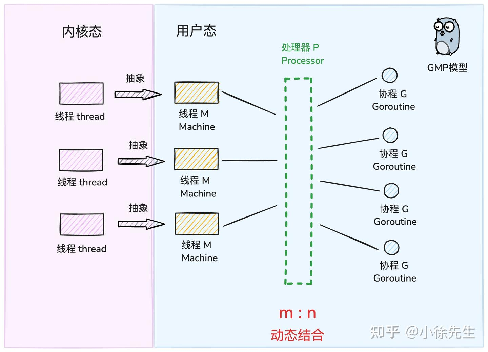
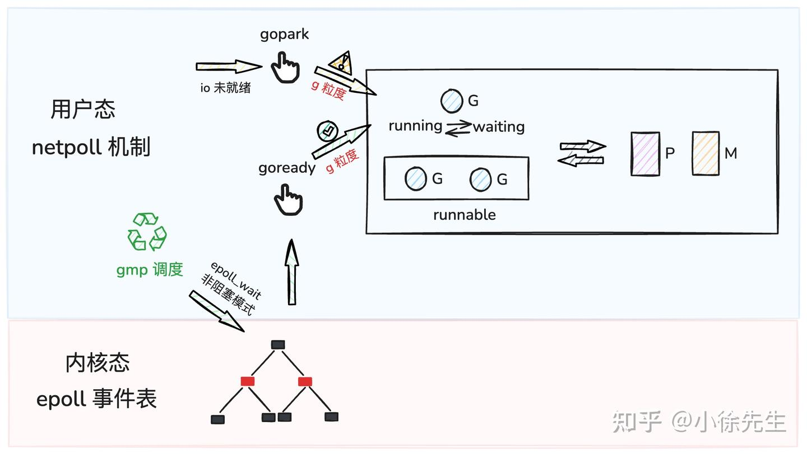
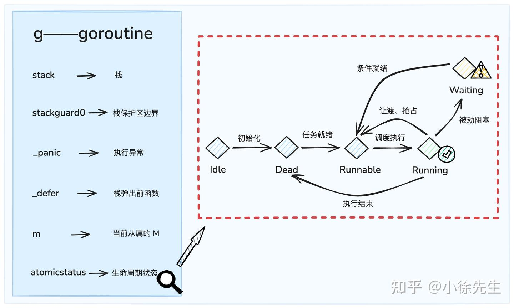
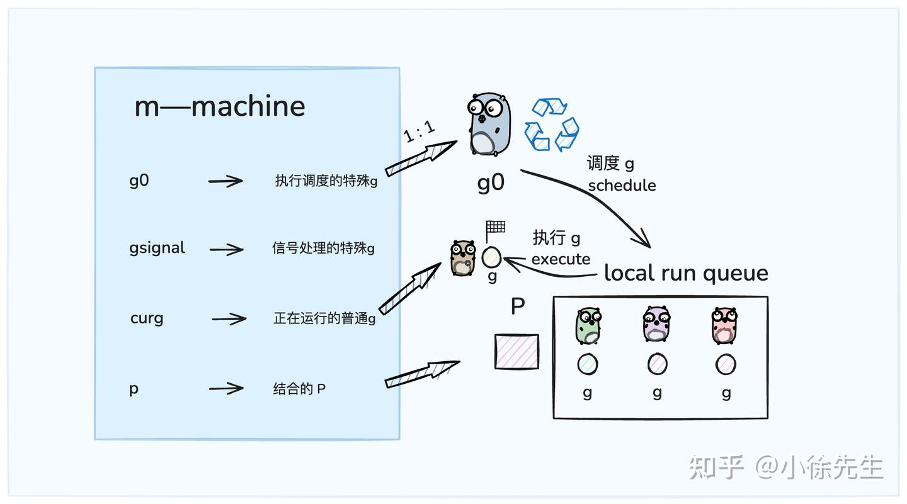
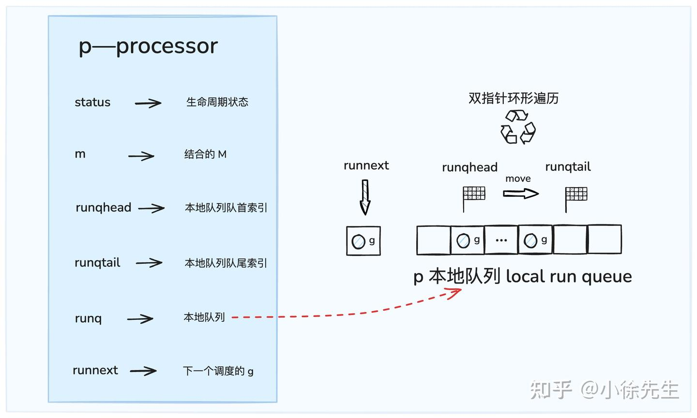
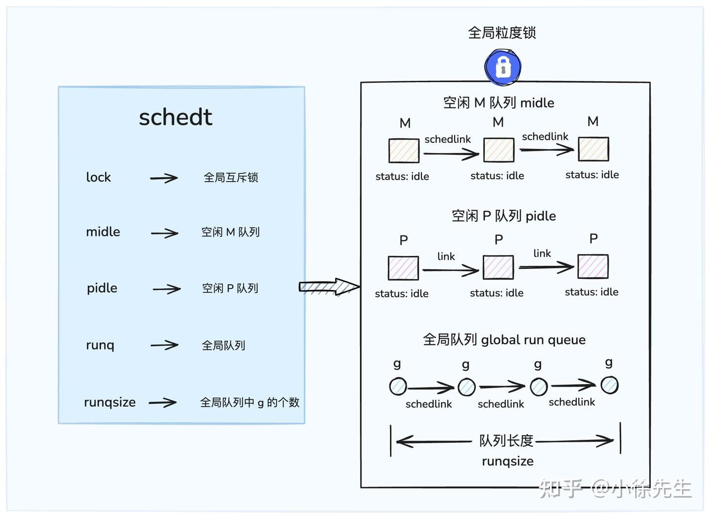
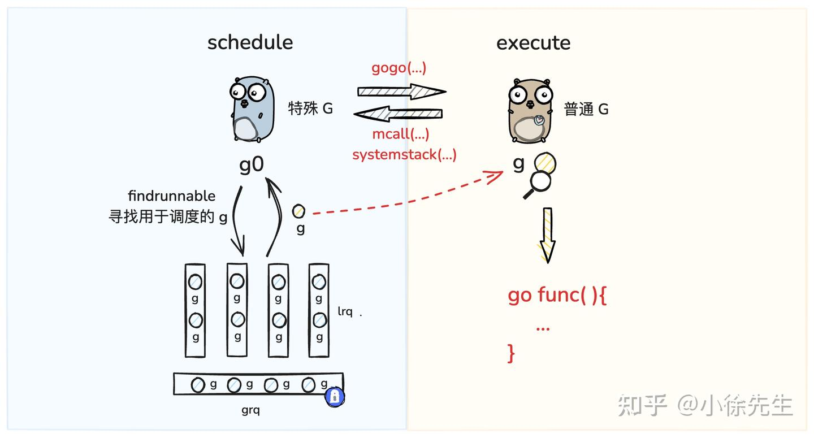

来源b站：小徐先生
(解说Golang GMP 实现原理)[https://www.bilibili.com/video/BV1oT411Y7m3/?spm_id_from=333.1007.top_right_bar_window_custom_collection.content.click&vd_source=917ef87e48a267f0acc88f766dea0a6e]

# golang GMP实现原理

## 1. GMP概念

### 线程(Thread)到协程(goroutine)
+ 线程是**操作系统内核**视角下的最小调度单元，其创建、销毁、切换、调度都需要由内核参与
+ 协程又称为用户态线程，是用户程序对对线程概念的二次封装，和线程为多对一关系，在逻辑意义上属于更细粒度的调度单元，其**调度过程由用户态闭环完成**，无需内核介入。创建销毁、调度在用户态完成。一个协程阻塞会导致从属同一线程的所有协程无法执行

线程更加简单直观，天然契合操作系统调度模型；协程是用户态下二次加工的产物，需要引入额外的复杂度，但是相对于线程而言有着更轻的粒度和更小的开销.


### 从协程到goroutine

goroutine 是其对协程的本土化实现, golang优化后的特殊协程
+ 与线程存在映射关系，M:N
+ 创建、销毁、调度在用户态完成，对内核透明，足够轻便，弱依赖内核
+ 可利用多个线程，实现并行
+ 调度器实现和线程间的动态绑定
+ 栈空间大小可动态扩缩

#### goroutine相对于原生协程的优势
goroutine其本身是强依附于 gmp（goroutine-machine-processor）体系而生的
+ g 与 p、m 之间可以动态结合，整个调度过程有着很高的灵活性
+ g 栈空间大小可以动态扩缩，既能做到使用方便，也尽可能地节约了资源

## 2. GMP模型
### g
+ g，即 goroutine，是 golang 中对协程的抽象；
+ g 有自己的运行栈、生命周期状态、以及执行的任务函数（用户通过 go func 指定）；
+ g 需要绑定在 m 上执行，在 g 视角中，可以将 m 理解为它的 cpu

gmp 理解为一个任务调度系统，那么 g 就是这个系统中所谓的“任务”，是一种需要被分配和执行的“资源

### m
+ m 即 machine，是 golang 中对线程的抽象；
+ m 需要和 p 进行结合，从而进入到 gmp 调度体系之中
+ m 的运行目标始终在 g0 和 g 之间进行切换——当运行 g0 时执行的是 m 的调度流程，负责寻找合适的“任务”，也就是 g；当运行 g 时，执行的是 m 获取到的”任务“，也就是用户通过 go func 启动的 goroutine
gmp 理解为一个任务调度系统，那么 m 就是这个系统中的”引擎“. 当 m 和 p 结合后，就限定了”引擎“的运行是围绕着 gmp 这条轨道进行的，使得”引擎“运行着两个周而复始、不断交替的步骤——寻找任务（执行g0）；执行任务（执行g）


### p
+ p 即 processor，是 golang 中的调度器；
+ p 可以理解为 m 的执行代理，m 需要与 p 绑定后，才会进入到 gmp 调度模式当中；因此 p 的数量决定了 g 最大并行数量（可由用户通过 GOMAXPROCS 进行设定，在超过 CPU 核数时无意义）
+ p 是 g 的存储容器，其自带一个本地 g 队列（local run queue，简称 lrq），承载着一系列等待被调度的 g

gmp 理解为一个任务调度系统，那么 p 就是这个系统中的”中枢“，当其和作为”引擎“ 的 m 结合后，才会引导“引擎”进入 gmp 的运行模式；同时 p 也是这个系统中存储“任务”的“容器”，为“引擎”提供了用于执行的任务资源.

### 宏观模型


#### 架构分析（存储容器设计）
+ p 的本地队列 lrq（local run queue）：这是每个 p 私有的 g 队列，通常由 p 自行访问，并发竞争情况较少，因此设计为无锁化结构，通过 CAS（compare-and-swap）操作访问
    - 当 m 与 p 结合后，不论是创建 g 还是获取 g，都优先从私有的 lrq 中获取，从而尽可能减少并发竞争行为；这里聊到并发情况较少，但并非完全没有，是因为还可能存在来自其他 p 的窃取行为
+ 全局队列 grq（global run queue）：是全局调度模块 schedt 中的全局共享 g 队列，作为当某个 lrq 不满足条件时的备用容器，因为不同的 m 都可能访问 grq，因此并发竞争比较激烈，访问前需要加全局锁

#### g放入和取出容器
+ put g：当某个 g 中通过 go func(){...} 操作创建子 g 时，会先尝试将子 g 添加到当前所在 p 的 lrq 中（无锁化）；如果 lrq 满了，则会将 g 追加到 grq 中（全局锁）. 此处采取的思路是“就近原则”
+ get g：gmp 调度流程中，m 和 p 结合后，运行的 g0 会不断寻找合适的 g 用于执行，此时会采取“负载均衡”的思路，遵循如下实施步骤
    - 优先从当前 p 的 lrq 中获取 g（无锁化-CAS）
    - 从全局的 grq 中获取 g（全局锁）
    - 取 io 就绪的 g（netpoll 机制）
    - 从其他 p 的 lrq 中窃取 g（无锁化-CAS）

## 3. gmp生态
在 golang 中已经完全屏蔽了线程的概念,将 goroutine 统一为整个语言层面的并发粒度，并遵循着 gmp 的秩序进行运作。gmp理念下的工具案例

### golang的内存管理模块

为每个 p 准备了一份私有的高速缓存——mcache，能够无锁化地完成一部分 p 本地的内存分配操作.

### 并发工具

在 golang 中的并发工具（例如锁 mutex、通道 channel 等）均契合 gmp 作了适配改造，保证在执行阻塞操作时，会将阻塞粒度限制在 g（goroutine）而非 m（thread）的粒度，使得阻塞与唤醒操作都属于用户态行为，无需内核的介入，同时一个 g 的阻塞也完全不会影响 m 下其他 g 的运行.

- 博主近期尝试着使用 c++ 效仿 gmp 实现一套协程调度体系，虽然还原出了其中大部分功能，但在使用上还是存在一个很大的缺陷，就是 c++ 标准库中的并发工具（如 lock、semaphore 等）对应的阻塞粒度都是 thread 级别的，这就导致一个协程（coroutine）的阻塞会上升到线程（thread）级别，并导致其他 goroutine 也丧失被执行的机会.

### io多路复用

在设计 io 模型时，golang 采用了 linux 系统提供的 epoll 多路复用技术，然而为了因为 epoll_wait 操作而引起 m（thread）粒度的阻塞，golang 专门设计一套 netpoll 机制，使用用户态的 gopark 指令实现阻塞操作，使用非阻塞 epoll_wait 结合用户态的 goready 指令实现唤醒操作，从而将 io 行为也控制在 g 粒度，很好地契合了 gmp 调度体系

## 4. gmp核心数据结构
### g详设

```go
// 一个 goroutine 的具象类
type g struct {
	// g 的执行栈空间
	stack       stack   
        /*
            栈空间保护区边界，用于探测是否执行栈扩容
            在 g 超时抢占过程中，用于传递抢占标识
        */
	stackguard0 uintptr 
	// ...
 
        // 记录 g 执行过程中遇到的异常    
	_panic    *_panic 
        // g 中挂载的 defer 函数，是一个 LIFO 的链表结构
	_defer    *_defer 

        // g 从属的 m
	m         *m      
        // ...  
        /*
            g 的状态
            // g 实例刚被分配还未完成初始化
            _Gidle = iota // 0

            // g 处于就绪态.  可以被调度 
            _Grunnable // 1

            // g 正在被调度运行过程中
            _Grunning // 2

            // g 正在执行系统调用
            _Gsyscall // 3

            // g 处于阻塞态，需要等待其他外部条件达成后，才能重新恢复成就绪态
            _Gwaiting // 4

            // 生死本是一个轮回. 当 g 调度结束生命终结，或者刚被初始化准备迎接新生前，都会处于此状态
            _Gdead // 6
        */
        atomicstatus uint32
        // ...
        // 进入全局队列 grq 时指向相邻 g 的 next 指针
        schedlink    guintptr
        // ...
}
```
### m详设

m（machine）是 go 对 thread 的抽象
+ g0：执行调度流程的特殊 g（不由用户创建，是与 m 一对一伴生的特殊 g，为 m 寻找合适的普通 g 用于执行）
+ gsignal：执行信号处理的特殊 g（不由用户创建，是与 m 一对一伴生的特殊 g，处理分配给 m 的 signal）
+ curg：m 上正在执行的普通 g（由用户通过 go func(){...} 操作创建）
+ p：当前与 m 结合的 p
```go
type m struct {
        // 用于调度普通 g 的特殊 g，与每个 m 一一对应
	g0      *g     
	// ...
	// m 的唯一 id
	procid        uint64            
        // 用于处理信号的特殊 g，与每个 m 一一对应
	gsignal       *g              
	// ...
        // m 上正在运行的 g
	curg          *g       
	// m 关联的 p
	p             puintptr 
	// ...
        // 进入 schedt midle 链表时指向相邻 m 的 next 指针 
        schedlink     muintptr
        // ...
}
```
将 m 的运行目标划分为 g0 和 g ，两者是始终交替进行的：g0 就类似于引擎中的调度逻辑，检索任务列表寻找需要执行的任务；g 就是由 g0 找到并分配给 m 执行的一个具体任务.

### p详设

p （processor）是 gmp 中的调度器
+ status：p 生命周期状态
+ m：当前与 p 结合的 m
+ runq：p 私有的 g 队列——local run queue
+ runqhead：lrq 中队首节点的索引
+ runqtail：lrq 中队尾节点的索引
+ runnext：lrq 中的特定席，指向下一个即将执行的 g
```go
type p struct {
	id          int32
        /*
            p 的状态
            // p 因缺少 g 而进入空闲模式，此时会被添加到全局的 idle p 队列中
            _Pidle = iota // 0

            // p 正在运行中，被 m 所持有，可能在运行普通 g，也可能在运行 g0
            _Prunning // 1

            // p 所关联的 m 正在执行系统调用. 此时 p 可能被窃取并与其他 m 关联
            _Psyscall // 2

            // p 已被终止
            _Pdead // 4
        */
	status      uint32 // one of pidle/prunning/...
        // 进入 schedt pidle 链表时指向相邻 p 的 next 指针
	link        puintptr        
	// ...
	// p 所关联的 m. 若 p 为 idle 状态，可能为 nil
	m           muintptr   // back-link to associated m (nil if idle)
	// lrq 的队首
	runqhead uint32
        // lrq 的队尾
	runqtail uint32
        // q 的本地 g 队列——lrq
	runq     [256]guintptr
	// 下一个调度的 g. 可以理解为 lrq 中的特等席
	runnext guintptr
	// ...
}
```

### schedt详设

schedt 是全局共享的资源模块，在访问前需要加全局锁：
+ lock：全局维度的互斥锁
+ midle：空闲 m 队列
+ pidle：空闲 p 队列
+ runq：全局 g 队列——global run queue，简称 grq
+ runqsize：grq 中存在的 g 个数
```go
// 全局调度模块
type schedt struct {
	// ...
        // 互斥锁
	lock mutex

	// 空闲 m 队列
	midle        muintptr // idle m's waiting for work
	// ...
        // 空闲 p 队列
	pidle      puintptr // idle p's
	// ...

	// 全局 g 队列——grq
	runq     gQueue
        // grq 中存量 g 的个数
	runqsize int32
	// ...
}
```
之所以存在 midle 和 pidle 的设计，就是为了避免 p 和 m 因缺少 g 而导致 cpu 空转. 对于空闲的 p 和 m，会被集成到空闲队列中，并且会暂停 m 的运行

## 5. gmp的调度流程
所谓调度，指的是一个由用户通过 go func(){...} 操作创建的 g，是如何被 m 上的 g0 获取并执行的，所以简单来说，就是由 g0 -> g 的流转过程.


### g0与g

在每个 m 中会有一个与之伴生的 g0，其任务就是不断寻找可执行的 g. 所以对一个 m 来说，其运行周期就是处在 g0 与 g 之间轮换交替的过程中
```go
type m struct {
        // 用于寻找并调度普通 g 的特殊 g，与每个 m 一一对应
	g0      *g     
        // ...
        // m 上正在运行的普通 g
	curg          *g       
	// ...
}
```
在 m 运行中，能够通过几个桩方法实现 g0 与 g 之间执行权的切换:
g -> g0：mcall、systemstack
g0 -> g：gogo

m 通过 p 调度执行的 goroutine 永远在普通 g 和 g0 之间进行切换，当 g0 找到可执行的 g 时，会调用 gogo 方法，调度 g 执行用户定义的任务；当 g 需要主动让渡或被动调度时，会触发 mcall 方法，将执行权重新交还给 g0.

### 调度类型

#### 1. 主动调度
一种用户主动执行让渡的方式，主要方式是，用户在执行代码中调用了 runtime.Gosched 方法，此时当前 g 会当让出执行权，主动进行队列等待下次被调度执行.

#### 2. 被动调度
因当前不满足某种执行条件，可能会陷入阻塞态无法被p调度，把当前执行的goroutine由一个running状态切换成waiting状态，直到关注的条件达成后，g才从阻塞中被唤醒，重新进入可执行队列等待被调度.

常见的被动调度触发方式为因 channel 操作或互斥锁操作陷入阻塞等操作，底层会走进 gopark 方法。由running切换成waiting。底层由mcall机制，将执行权由普通的g交还给当前m的g0，g0实现当前陷入被动阻塞态的goroutine状态切换，从runing状态切换成waiting状态，与调度器p进行解绑。当前g0做完以上动作后，尝试获取下一个可以被执行调度的goroutine

如果陷入被动阻塞的goroutine，唤醒时机到达之后，受goready影响，它对应的状态会在另一个p或某一个p对应的g0过程中，把其他的被动阻塞状态的g， goready 方法通常与 gopark 方法成对出现，能够将 g 从阻塞态中恢复，重新进入等待执行的状态. 从waiting状态切换成runnable状态. 由被动阻塞态中刚刚被唤醒的g0尝试加入到主动执行唤醒动作的p的本地队列中，加入成功的话，可能会优先作为唤醒者的p所调度到

#### 3. 正常调度
g 中的执行任务已完成，g0 会将当前 g 置为死亡状态，发起新一轮调度.

goroutine执行用户业务的代码逻辑完成，正常回收销毁，通过mcall机制把执行权回归到g0手中，再由g0决定下一步执行哪个goroutine 


#### 4. 抢占调度
倘若 g 执行系统调用超过指定的时长，且全局的 p 资源比较紧缺，此时将 p 和 g 解绑，抢占出来用于其他 g 的调度. 等 g 完成系统调用后，会重新进入可执行队列中等待被调度.

值得一提的是，前 3 种调度方式都由 m 下的 g0 完成，唯独抢占调度不同.

因为**发起系统调用**时需要打破用户态的边界进入内核态，此时**m 也会因系统调用而陷入僵直**，无法主动完成抢占调度的行为.（m处在不可用状态）


因此，在 Golang 进程会有一个全局监控协程 monitor g 的存在，这个 g 会越过 p 直接与一个 m 进行绑定，不断轮询对所有 p 的执行状况进行监控. 倘若发现满足抢占调度的条件，则会从第三方的角度出手干预，主动发起该动作. （将p与其他的m进行绑定，在进行后续正常调度）


### 宏观调度流程


