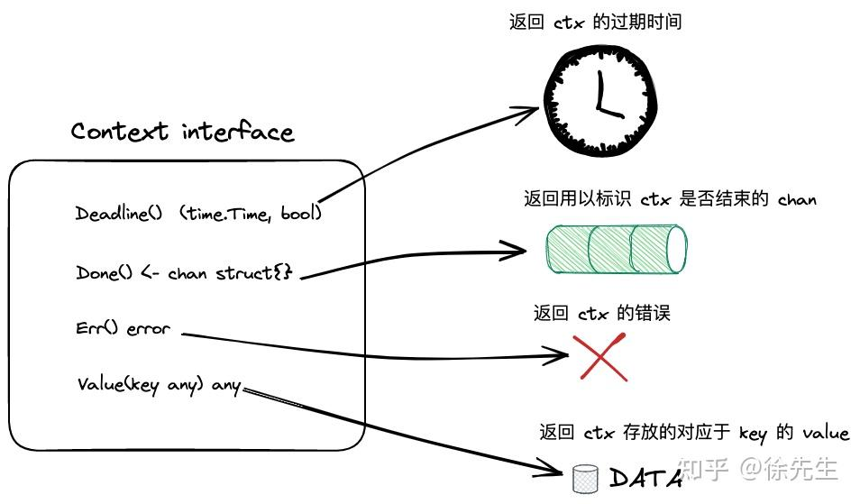
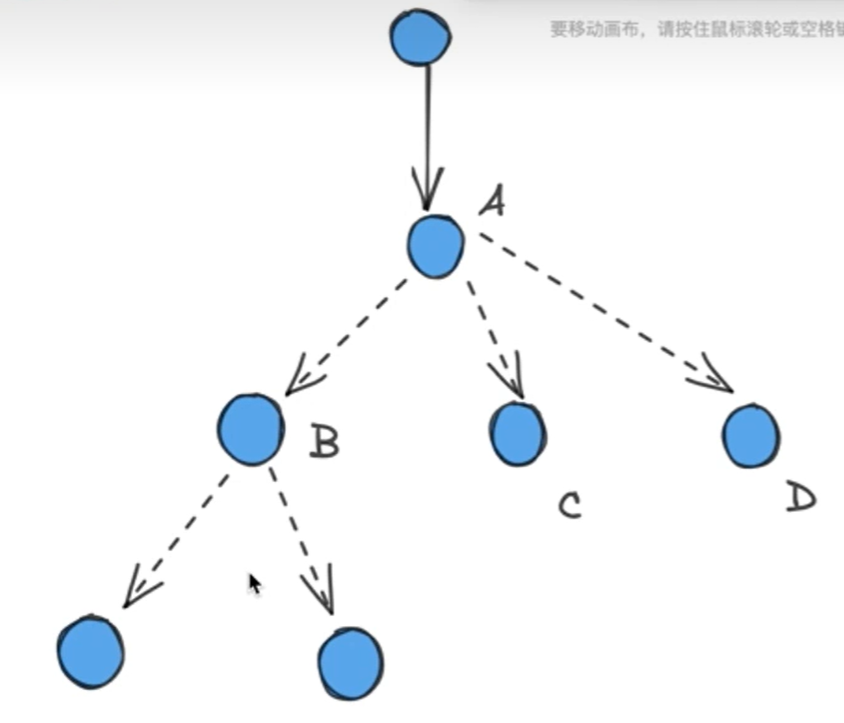
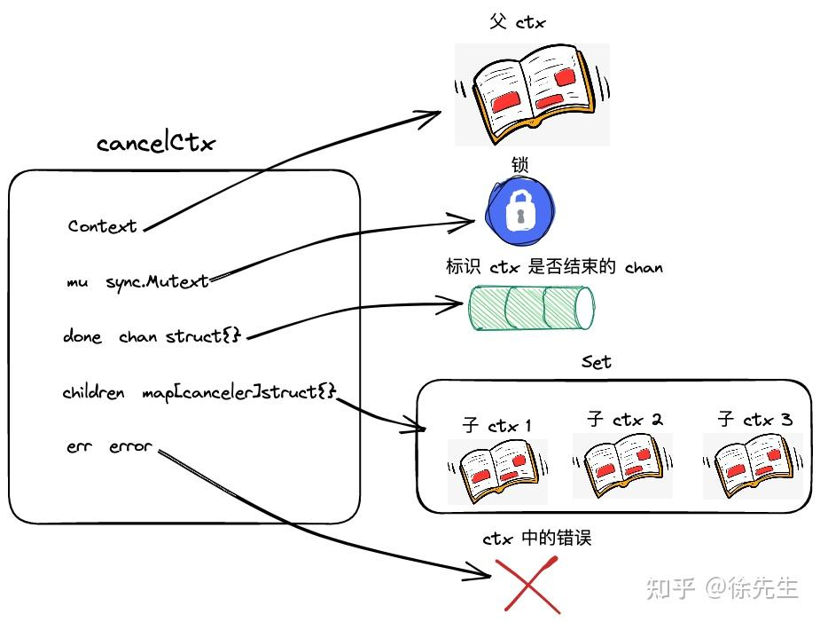
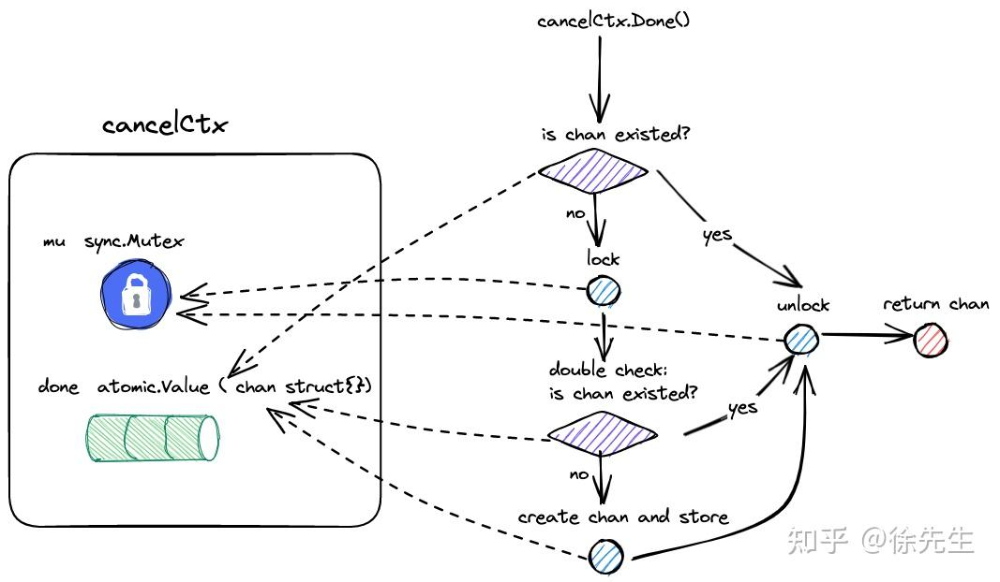

# go context的底层原理
在异步场景中实现并发协调，对goroutine的生命周期控制。还兼有数据存储能力

作为调用链路的上下文，

## context.Context 



Context 为 interface，定义了四个核心 api：

1. （1）Deadline：返回 context 的过期时间；

2. （2）Done：返回 context 中的 channel；
返回一个只读的channel，可作为信号发送器，时时刻刻监听channel动静，表示context上下文的生命周期是否已结束。

3. （3）Err：返回错误；

4. （4）Value：返回 context 中的对应 key 的值.

### 标准error

## emptyCtx
### 类的实现
```go
// emptyCtx 是一个空的 context，本质上类型为一个整型；
type emptyCtx int

// Deadline 方法会返回一个公元元年时间以及 false 的 flag，标识当前 context 不存在过期时间；
func (*emptyCtx) Deadline() (deadline time.Time, ok bool) {
    return
}

// Done 方法返回一个 nil 值，用户无论往 nil 中写入或者读取数据，均会陷入阻塞；
func (*emptyCtx) Done() <-chan struct{} {
    return nil
}

func (*emptyCtx) Err() error {
    return nil
}

func (*emptyCtx) Value(key any) any {
    return
}
```

###  context.Background() & context.TODO()
context.Background() 和 context.TODO() 方法返回的均是 emptyCtx 类型的一个实例
```go
var (
    background = new(emptyCtx)
    todo       = new(emptyCtx)
)


func Background() Context {
    return background
}


func TODO() Context {
    return todo
}
```

## cancelCtx

### 引入
1. 并发调用链路


+ 同步调用
串行化、有条链，父方法和子方法会形成一个压栈。保证子方法协程完成之后，父方法拿到响应的结果，才能串行化往下执行

+ 异步调用
父协程与子协程是松耦合的状况，父协程对子协程的感知较弱，父协程可异步创建多个子协程。创建完成之后便可执行后续的业务，与子协程没有阻塞、同步过程。

2. 并发的特点
如果创建一个异步协程或线程，不知道什么时候会终止，则不应该去创建。即不可滥用并发，做好并发控制。否则可能会造成协程泄漏和安全问题


每一个子context有唯一指向的父context，父context可创建多个不同的子context。context形成上图多叉树，根节点一定是emptyCtx

+ 生命周期的终止事件传递的单向性，用来作父子协程的并发控制。根据父子之间联动，单向传递，终止特性的方式

### cancelCtx 数据结构


```go
type cancelCtx struct {
    Context

    mu       sync.Mutex            // protects following fields
    done     atomic.Value          // of chan struct{}, created lazily, closed by first cancel call
    children map[canceler]struct{} // set to nil by the first cancel call
    err      error                 // set to non-nil by the first cancel call
}

type canceler interface {
	cancel(removeFromParent bool, err error)
	Done() <-chan struct{}
}
```

+ （1）embed 了一个 context 作为其父 context. 可见，cancelCtx 必然为某个 context 的子 context；

+ （2）内置了一把锁，用以协调并发场景下的资源获取；互斥锁以进行并发保护

+ （3）done：实际类型为 chan struct{}，即用以反映 cancelCtx 生命周期的通道；

+ （4）children：一个 set，指向 cancelCtx 的所有子 context；只关心到子context中的cancel和Done两个方法。职责内聚、边界分明

+ （5）err：记录了当前 cancelCtx 的错误. 必然为某个 context 的子 context；

### Deadline 方法
cancelCtx 未实现该方法，仅是 embed 了一个带有 Deadline 方法的 Context interface，因此倘若直接调用会报错. 调用父context的 Deadline 方法，如果父context为空context，则直接返回一个初始的时间和false

### Done 方法

```go
func (c *cancelCtx) Done() <-chan struct{} {
	d := c.done.Load()
	if d != nil {
		return d.(chan struct{})
	}
	c.mu.Lock()
	defer c.mu.Unlock()
	d = c.done.Load()
	if d == nil {
		d = make(chan struct{})
		c.done.Store(d)
	}
	return d.(chan struct{})
}
```
+ （1）基于 atomic 包，读取 cancelCtx 中的 chan；倘若已存在，则直接返回；

+ （2）加锁后，在此检查 chan 是否存在，若存在则返回；（double check）

+ （3）初始化 chan 存储到 aotmic.Value 当中，并返回.（懒加载机制）

### Err 方法
```go
func (c *cancelCtx) Err() error {
	c.mu.Lock()
	err := c.err
	c.mu.Unlock()
	return err
}
```

### Value 方法
```go
func (c *cancelCtx) Value(key any) any {
	if key == &cancelCtxKey {
		return c
	}
	return value(c.Context, key)
}
```
cancelCtxKey 全局整型变量 不可导出类型，不可能是外部用户传入的key，应该是内部某个环节调用

### context.WithCancel()
#### context.WithCancel()
```go
func WithCancel(parent Context) (ctx Context, cancel CancelFunc) {
	if parent == nil {
		panic("cannot create context from nil parent")
	}
	c := newCancelCtx(parent)
	propagateCancel(parent, &c)
	return &c, func() { c.cancel(true, Canceled) }
}
```
+ （1）校验父 context 非空；

+ （2）注入父 context 构造好一个新的 cancelCtx；

+ （3）在 propagateCancel 方法内启动一个守护协程，以保证父 context 终止时，该 cancelCtx 也会被终止；

+ （4）将 cancelCtx 返回，连带返回一个用以终止该 cancelCtx 的闭包函数.


#### newCancelCtx

```go
func newCancelCtx(parent Context) cancelCtx {
	return cancelCtx{Context: parent}
}
```
+ （1）注入父 context 后，返回一个新的 cancelCtx.

#### propagateCancel
```go
func propagateCancel(parent Context, child canceler) {
	done := parent.Done()
	if done == nil {
		return // parent is never canceled
	}

	select {
	case <-done:
		// parent is already canceled
		child.cancel(false, parent.Err())
		return
	default:
	}

	if p, ok := parentCancelCtx(parent); ok {
		p.mu.Lock()
		if p.err != nil {
			// parent has already been canceled
			child.cancel(false, p.err)
		} else {
			if p.children == nil {
				p.children = make(map[canceler]struct{})
			}
			p.children[child] = struct{}{}
		}
		p.mu.Unlock()
	} else {
		atomic.AddInt32(&goroutines, +1)
		go func() {
			select {
			case <-parent.Done():
				child.cancel(false, parent.Err())
			case <-child.Done():
			}
		}()
	}
}
```
+ （1）倘若 parent 是不会被 cancel 的类型（如 emptyCtx），则直接返回；

+ （2）倘若 parent 已经被 cancel，则直接终止子 context，并以 parent 的 err 作为子 context 的 err；

+ （3）假如 parent 是 cancelCtx 的类型，则加锁，并将子 context 添加到 parent 的 children map 当中；

+ （4）假如 parent 不是 cancelCtx 类型，但又存在 cancel 的能力（比如用户自定义实现的 context），则启动一个协程，通过多路复用的方式监控 parent 状态，倘若其终止，则同时终止子 context，并透传 parent 的 err.


