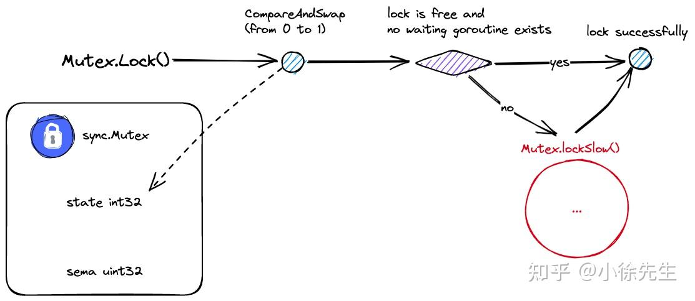

## 学习资源
[https://www.bilibili.com/video/BV1kv4y157wj?p=1&vd_source=917ef87e48a267f0acc88f766dea0a6e](一次搞懂golang单机锁实现原理)

## 互斥锁基本用法
map不是并发安全的（临界资源），加入锁对其保护
### 普通锁
```go
type MyConcurrentMap struct {
    sync.Mutex // 为一个实体类 不用显式地进行初始化
    mp map[int]int
}

type NewMyConcurrentMap() *MyConcurrentMap struct {
    return &MyConcurrentMap{
        mp: make(map[int]int),
    }
}

func (m *MyConcurrentMap) Get(key int)(int, bool ){
    // 并发自由
    m.Mutex.Lock()
    // 在入口处设置关卡，保证获取到临界资源前做收口，每次只有一个goroutine能访问到临界资源，
    v, ok := m.mp[key]
    m.Mutex.UnLock()
    // 并发自由
    return v, ok
}
func (m *MyConcurrentMap) Put(key int,value int){
    m.Mutex.Lock()
    m.mp[key] = value
    m.Mutex.UnLock()
}
func (m *MyConcurrentMap) Delete(key int){
    m.Mutex.Lock()
    delete(m.mp, key)
    m.Mutex.UnLock()
}
```
Get、Put、Delete三种方法都是互斥的，三者共享同一把锁，则在同一时刻，只有这三种中的一个goroutine能访问临界资源。

### 读写锁
读、查询不存在并发问题，无侵入性；写操作具有更侵入性，删除、更新、创建，需要加锁，保证数据一致性。写+写、读+写会引起问题
```go
type MyConcurrentMap struct {
    sync.Mutex // 为一个实体类 不用显式地进行初始化
    mp map[int]int
}

type NewMyConcurrentMap() *MyConcurrentMap struct {
    return &MyConcurrentMap{
        mp: make(map[int]int),
    }
}

func (m *MyConcurrentMap) Get(key int)(int, bool ){
    // 并发自由
    m.RWMutex.RLock()
    // 在入口处设置关卡，保证获取到临界资源前做收口，每次只有一个goroutine能访问到临界资源，
    v, ok := m.mp[key]
    m.Mutex.UnRLock()
    // 并发自由
    return v, ok
}
func (m *MyConcurrentMap) Put(key int,value int){
    m.Mutex.Lock()
    m.mp[key] = value
    m.Mutex.UnLock()
}
func (m *MyConcurrentMap) Delete(key int){
    m.Mutex.Lock()
    delete(m.mp, key)
    m.Mutex.UnLock()
}
```
此时读和写仍是互斥的，当有读操作时，写操作会阻塞，反过来也是。以上的好处是：同时有两个读goroutine都尝试并发读，则是允许的


##  Introduction
1. 不同的goroutine之间希望在全局的秩序之下相互协作、共同的推进系统中任务的执行（context、channel、线程池），做到不同goroutine间的团结协作，全局并发的掌控
2. 多个并发访问全局的共享的状态数据同时，需要注意数据前后的一致性问题，避免逻辑等一些问题，状态数据产生偏差，引起严重逻辑错误。原生数据结构不支持并发读写的操作。如：map使用间接性扩容，基于并发读写时，底层会出现严重错误。

并发访问，共享数据，使用锁实现在关键节点和临界资源面前，并发退化为串行，遵守一定秩序，一次一个goroutine对状态数据的读写

## Sync.Mutex互斥锁
基于互斥锁，对map进行保护，保证能够并发安全的访问


在入口处，设置关卡，保证每次真正接触到临界资源之前，做收口，一次只有一个goroutine能访问到对应的邻接资源，
```go
// 并发、自由
m.Mutex.Lock

// 保证一次只有一个goroutine

m.Mutex.Unlock
// 并发、自由
```
#### 读写锁（升级）
写操作：涉及修改、创建、更新，更具有侵入性、更重。

并发读（查阅）并不会产生问题；读+写； 写+写，后两者会对数据进行修改。RWMutex保证并发读情况下，不需要额外加锁的成本。即在读操作情况下（无侵入性操作）加入读锁


### Mutex的核心

#### 上锁和解锁
通过Mutex内的一个状态值标识锁的状态。上锁：将0改为1；解锁：将1置为0；

1. 锁是独占的，只有显式将锁的状态从0改为1，才视为加锁成功
2. 尝试上锁时，先去读取锁的值，将锁从0改为1时，若锁的值被其它角色后发先至，提前被改为1了，破坏了整个流程的原子性，误以为加锁成功，且没有进行double check或前置判断。（常见于并发场景中的并发写，状态不一致，导致状态数据回滚）。上锁和解锁的过程，需要保证原子性

#### 自旋到阻塞的升级
针对goroutine加锁，锁已经被抢占，有以下两种策略
1. 阻塞/唤醒：将当前goroutine阻塞挂起，置为waiting的状态，释放processer处理器的资源，让其他可执行的goroutine能更多地被调度执行。直到锁被释放后，以回调方式，将阻塞goroutine重新唤醒，由waiting转为runnable状态，重新有被调度的机会，进行锁争夺。


2. 自旋+CAS：基于自旋结合CAS，重新校验锁的状态并尝试获取锁，始终把主动权掌握手里。自旋是主动轮询的模型，无数次循环轮询的进行尝试加锁的动作，假设当前尝试加锁失败，可能会短暂休息会儿，过一会儿再开启下一个循环，再主动尝试一次执行加锁，直到成功为止。加锁通过CAS(compare and swap)，是基于CPU原理，保证对比和交换两步是不可分割的，保证原子性。


| 锁竞争方案      | 优势 |    劣势     |   适用场景    |
| :----:      |    :----:   |   :----: |    :----: |
| 阻塞/唤醒（悲观锁）      | 精准打击，不浪费 CPU 时间片     | 需要挂起协程，进行上下文切换，操作较重   |   并发竞争激烈的场景  （获得锁的机会越渺茫）  |
| 自旋+CAS（乐观锁）   | 无需阻塞协程，短期来看操作较轻   | 长时间争而不得，会浪费 CPU 时间片   |    并发竞争强度低的场景 （越有机会获得锁） |


sync.Mutex结合以上两种方案，以下方案，
+ （1）首先保持乐观，goroutine 采用自旋 + CAS 的策略争夺锁；

+ （2）尝试持续受挫达到一定条件后，判定当前过于激烈，则由自旋转为 阻塞/挂起模式.


自旋模式转为阻塞模式的具体条件拆解
1. 自旋累积4次仍未取到结果
2. CPU单核或仅有单个P调度器；其它goroutine根本没机会释放锁，自旋纯属于空转
3. 当前P的执行队列仍有待执行的G（系统比较忙的时候），尝试谦让，将执行权让出来，让更有机会的goroutine进行执行，避免自旋影响到GMP调度效率


#### sync.Mutex运行过程中存在两种模式
1. 正常模式/非饥饿模式
默认采用的模式，当有goroutine从阻塞队列被唤醒时，会和此时先进入抢锁流程的goroutine进行锁资源的争夺，假如抢锁失败，会重新回到阻塞队列头部。（此时被唤醒的老goroutine相比于新的goroutine处于劣势地位。新goroutine可能存在多个，已经在占用CPU时间片，从而形成多对一的优势，对老goroutine不利）

2. 饥饿模式
饥饿：Mutex阻塞队列中存在goroutine长时间取不到锁，陷入饥荒状态
饥饿模式：当Mutex阻塞队列中存在处于饥饿态的goroutine时，进入模式，将抢锁流程由非公平制转为公平机制。stnc.Mutex为拯救陷入饥荒的老goroutine而启用的特殊机制，锁的所有权按照阻塞队列的顺序依次传递，新goroutine进行流程不得抢锁，而是进入队列尾部排队

##### 两种模式转换条件
默认为正常；

正常模式-》饥饿模式；阻塞队列存在goroutine等锁超过1ms而不得，进入饥饿状态

饥饿模式-》正常模式；阻塞队列已清空；或取得锁的goroutine等锁时间已低于1ms时，回到正常模式

正常模式灵活，机动性好，性能较好；饥饿模式严格死板。这两种模式切换，体现sync.Mutex为公平与性能之间作出的调整与权衡

##### goroutine 唤醒标识
为尽可能缓解竞争压力和性能损耗，sync.Mutex 会不遗余力在可控范围内减少一些无意义的并发竞争和操作损耗.

在实现上，sync.Mutex 通过一个 mutexWoken 标识位，标志出当前是否已有 goroutine 在自旋抢锁或存在 goroutine 从阻塞队列中被唤醒；倘若 mutexWoken 为 true，且此时有解锁动作发生时，就没必要再额外唤醒阻塞的 goroutine 从而引起竞争内耗.

### 数据结构
```go
type Mutex struct {
    state int32
    sema  uint32
}
```
+ （1）state：锁中最核心的状态字段，不同 bit 位分别存储了 mutexLocked(是否上锁)、mutexWoken（是否有 goroutine 从阻塞队列中被唤醒）、mutexStarving（是否处于饥饿模式）的信息
+ （2）sema：用于阻塞和唤醒 goroutine 的信号量.

##### 全局常量
```go
const (
    mutexLocked = 1 << iota // mutex is locked
    mutexWoken
    mutexStarving
    mutexWaiterShift = iota
    starvationThresholdNs = 1e6
)
```

+ （1）mutexLocked = 1：state 最右侧的一个 bit 位标志是否上锁，0-未上锁，1-已上锁；

+ （2）mutexWoken = 2：state 右数第二个 bit 位标志是否有 goroutine 从阻塞中被唤醒，0-没有，1-有；

+ （3）mutexStarving = 4：state 右数第三个 bit 位标志 Mutex 是否处于饥饿模式，0-非饥饿，1-饥饿；

+ （4）mutexWaiterShift = 3：右侧存在 3 个 bit 位标识特殊信息，分别为上述的 mutexLocked、mutexWoken、mutexStarving；

+ （5）starvationThresholdNs = 1 ms：sync.Mutex 进入饥饿模式的等待时间阈值.

#####  state 字段详述
Mutex.state 字段为 int32 类型，不同 bit 位具有不同的标识含义：

高 29 位的值聚合为一个范围为 0~2^29-1 的整数，表示在阻塞队列中等待的协程个数。后续在加锁/解锁处理流程中，会频繁借助位运算从 Mutex.state 字段中快速获取到以上信息，


#### Mutex.Lock()
##### Lock 方法主干

```go
func (m *Mutex) Lock() {
    if atomic.CompareAndSwapInt32(&m.state, 0, mutexLocked) {
        return
    }
    // Slow path (outlined so that the fast path can be inlined)
    m.lockSlow()
}
```
+ 首先进行一轮CAS(无锁算法)操作，假如当前未上锁且锁内不存在阻塞协程，则直接CAS抢锁成功返回

+ 第一轮初探失败，则进入lockSlow流程

#### Mutex.lockSlow()
局部变量

自旋空转

预设新值

