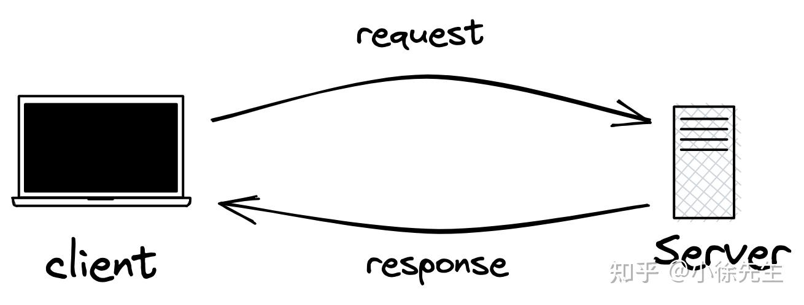
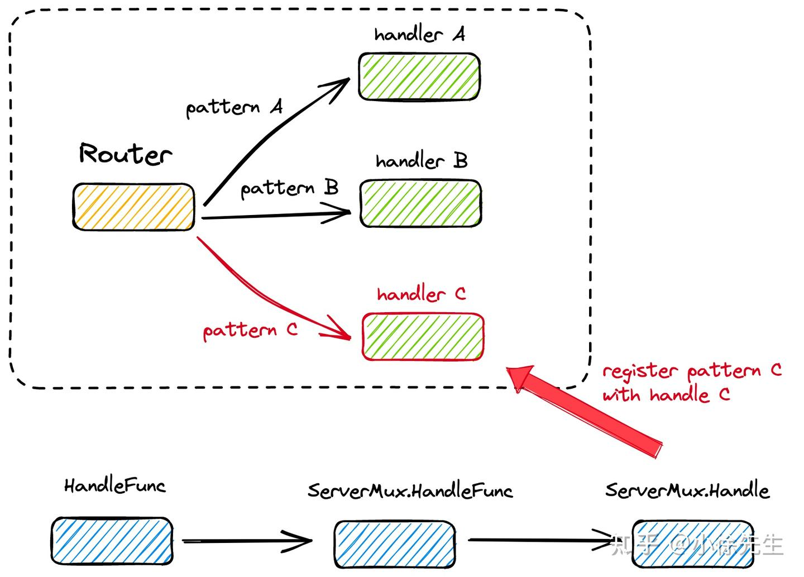
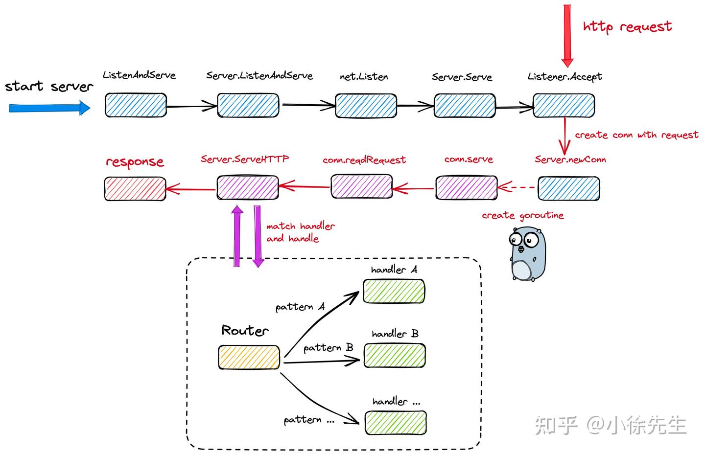
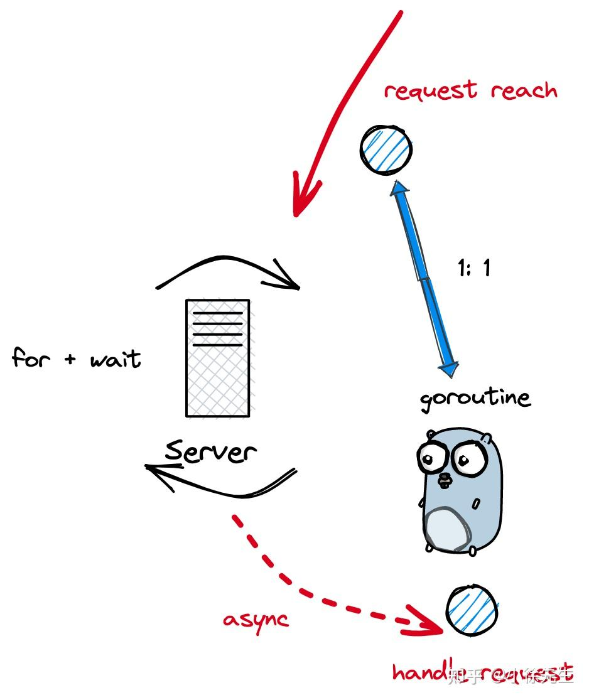
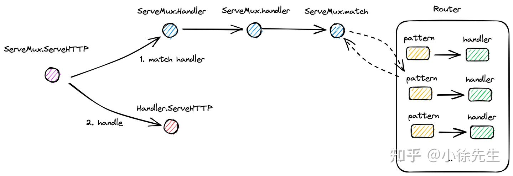
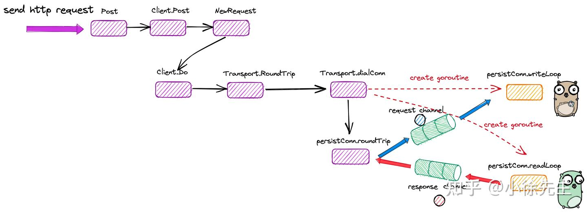
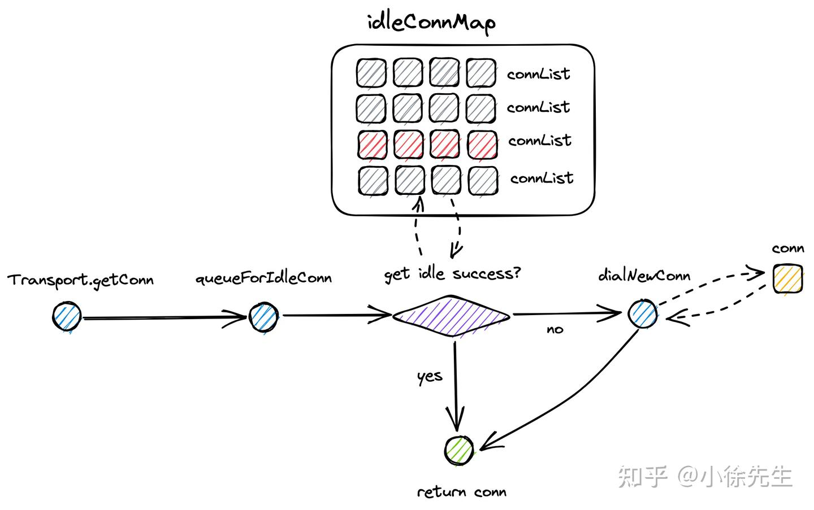

# HTTP标准库原理分析

## 整体框架
### C-S架构


#### 启动http服务
```go
func main() {
    http.HandleFunc("/ping", func(w http.ResponseWriter, r *http.Request) {
        w.Write([]byte("pong"))
    })
    http.ListenAndServe(":8091", nil)
}
```
+ 调用 http.HandleFunc 方法，注册了对应于请求路径 /ping 的 handler 函数
+ 调用 http.ListenAndServe，启动了一个端口为 8091 的 http 服务

#### 发送http请求
```go
func main() {
    reqBody, _ := json.Marshal(map[string]string{"key1": "val1", "key2": "val2"})
    
    resp, _ := http.Post(":8091", "application/json", bytes.NewReader(reqBody))
    defer resp.Body.Close()
    
    respBody, _ := io.ReadAll(resp.Body)
    fmt.Printf("resp: %s", respBody)
}
```

## 服务端
### 核心数据结构
#### Server
整个 http 服务端模块被封装在 Server 类当中.

Handler 是 Server 中最核心的成员字段，实现了从请求路径 path 到具体处理方法 handler 的注册和映射能力.

在用户构造 Server 对象时，倘若其中的 Handler 字段未显式声明，则会取 net/http 包下的单例对象 DefaultServeMux（ServerMux 类型） 进行兜底

```go
type Server struct {
    // server 的地址
    Addr string
    // 路由器.
    Handler Handler // handler to invoke, http.DefaultServeMux if nil
    // ...
}
```

#### Handler
暴露了方法： ServeHTTP.

该方法的作用是，根据 http 请求 Request 中的请求路径 path 映射到对应的 handler 处理函数，对请求进行处理和响应.

```go
type Handler interface {
    ServeHTTP(ResponseWriter, *Request)
}
```
大的handler和小的handler其实没有任何区别，都是同一个接口，都是处理请求.

#### ServeMux
ServeMux 是对 Handler 的具体实现，内部通过一个 map 维护了从 path 到 handler 的映射关系.
```go
type ServeMux struct {
    mu sync.RWMutex
    m map[string]muxEntry
    es []muxEntry // slice of entries sorted from longest to shortest.
    hosts bool // whether any patterns contain hostnames
}
```

#### muxEntry
muxEntry 为一个 handler 单元，内部包含了请求路径 path + 处理函数 handler 两部分.
```go
type muxEntry struct {
    h Handler
    pattern string 
}
```

### 注册 handler


在 net/http 包下声明了一个单例 ServeMux，当用户直接通过公开方法 http.HandleFunc 注册 handler 时，则会将其注册到 DefaultServeMux 当中.
```go
var DefaultServeMux = &defaultServeMux
var defaultServeMux ServeMux
func HandleFunc(pattern string, handler func(ResponseWriter, *Request)) {
    DefaultServeMux.HandleFunc(pattern, handler)
}
```

在 ServeMux.HandleFunc 内部会将处理函数 handler 转为实现了 ServeHTTP 方法的 HandlerFunc 类型，将其作为 Handler interface 的实现类注册到 ServeMux 的路由 map 当中.
```go
type HandlerFunc func(ResponseWriter, *Request)

// ServeHTTP calls f(w, r).
func (f HandlerFunc) ServeHTTP(w ResponseWriter, r *Request) {
    f(w, r)
}

func (mux *ServeMux) HandleFunc(pattern string, handler func(ResponseWriter, *Request)) {
    // ...
    mux.Handle(pattern, HandlerFunc(handler))
}
```
实现路由注册的核心逻辑位于 ServeMux.Handle 方法中
+ 将 path 和 handler 包装成一个 muxEntry，以 pattern 为 key 注册到路由 map ServeMux.m 中
+ 响应模糊匹配机制. 对于以 '/' 结尾的 path，根据 path 长度将 muxEntry 有序插入到数组 ServeMux.es 中.（模糊匹配机制的伏笔在 2.3 小节回收）

```go
func (mux *ServeMux) Handle(pattern string, handler Handler) {
    mux.mu.Lock()
    defer mux.mu.Unlock()
    // ...
    e := muxEntry{h: handler, pattern: pattern}
    mux.m[pattern] = e
    if pattern[len(pattern)-1] == '/' {
        mux.es = appendSorted(mux.es, e)
    }
    // ...
}
```
```go
func appendSorted(es []muxEntry, e muxEntry) []muxEntry {
    n := len(es)
    i := sort.Search(n, func(i int) bool {
        return len(es[i].pattern) < len(e.pattern)
    })
    if i == n {
        return append(es, e)
    }
    es = append(es, muxEntry{}) // try to grow the slice in place, any entry works.
    copy(es[i+1:], es[i:])      // Move shorter entries down
    es[i] = e
    return es
}
```

### 启动服务端

调用 net/http 包下的公开方法 ListenAndServe，可以实现对服务端的一键启动. 内部会声明一个新的 Server 对象，嵌套执行 Server.ListenAndServe 方法.

```go
func ListenAndServe(addr string, handler Handler) error {
    server := &Server{Addr: addr, Handler: handler}
    return server.ListenAndServe()
}
```
Server.ListenAndServe 方法中，根据用户传入的端口，申请到一个监听器 listener，继而调用 Server.Serve 方法.

```go
func (srv *Server) ListenAndServe() error {
    // ...
    addr := srv.Addr
    if addr == "" {
        addr = ":http"
    }
    ln, err := net.Listen("tcp", addr)
    // ...    
    return srv.Serve(ln)
}
```
#### Server.Serve 方法


+ 将 server 封装成一组 kv 对，添加到 context 当中
+ 开启 for 循环，每轮循环调用 Listener.Accept 方法阻塞等待新连接到达
+ 每有一个连接到达，创建一个 goroutine 异步执行 conn.serve 方法负责处理。方法的主干会立刻进入下一轮会继续调用listener.Accept方法进行监听
+ 如果没有请求到来，则会阻塞，被动阻塞。在gmp中，将p和m让出来，给其他的goroutine使用

```go
var ServerContextKey = &contextKey{"http-server"}
type contextKey struct {
    name string
}
func (srv *Server) Serve(l net.Listener) error {
   // ...
   ctx := context.WithValue(baseCtx, ServerContextKey, srv)
    for {
        rw, err := l.Accept()
        // ...
        connCtx := ctx
        // ...
        c := srv.newConn(rw)
        // ...
        go c.serve(connCtx)
    }
}
```
conn.serve 是响应客户端连接的核心方法：
+ 从 conn 中读取到封装到 response 结构体，以及请求参数 http.Request
+ 调用 serveHandler.ServeHTTP 方法，根据请求的 path 为其分配 handler
+ 通过特定 handler 处理并响应请求
```go
func (c *conn) serve(ctx context.Context) {
    // ...
    c.r = &connReader{conn: c}
    c.bufr = newBufioReader(c.r)
    c.bufw = newBufioWriterSize(checkConnErrorWriter{c}, 4<<10)

    for {
        w, err := c.readRequest(ctx)
        // ...
        serverHandler{c.server}.ServeHTTP(w, w.req)
        w.cancelCtx()
        // ...
    }
}
```
在 serveHandler.ServeHTTP 方法中，会对 Handler 作判断，倘若其未声明，则取全局单例 DefaultServeMux 进行路由匹配，呼应了 http.HandleFunc 中的处理细节.
```go
func (sh serverHandler) ServeHTTP(rw ResponseWriter, req *Request) {
    handler := sh.srv.Handler
    if handler == nil {
        handler = DefaultServeMux
    }
    // ...
    handler.ServeHTTP(rw, req)
}
```

兜兜转转依次调用 ServeMux.ServeHTTP、ServeMux.Handler、ServeMux.handler 等方法，最终在 ServeMux.match 方法中，以 Request 中的 path 为 pattern，在路由字典 Server.m 中匹配 handler，最后调用 handler.ServeHTTP 方法进行请求的处理和响应.
```go
func (mux *ServeMux) ServeHTTP(w ResponseWriter, r *Request) {
    // ...
    h, _ := mux.Handler(r)
    h.ServeHTTP(w, r)
}
func (mux *ServeMux) Handler(r *Request) (h Handler, pattern string) {
    // ...
    return mux.handler(host, r.URL.Path)
}
func (mux *ServeMux) handler(host, path string) (h Handler, pattern string) {
    mux.mu.RLock() // 共享加读锁，当新添加路由处理函数，则需要通过额外的读写锁
    defer mux.mu.RUnlock()
    
    // ...
    h, pattern = mux.match(path)
    // ...
    return
}
```
当通过路由字典 Server.m 未命中 handler 时，此时会启动模糊匹配模式，两个核心规则如下：

+ 以 '/' 结尾的 pattern 才能被添加到 Server.es 数组中，才有资格参与模糊匹配
+ 模糊匹配时，会找到一个与请求路径 path 前缀完全匹配且长度最长的 pattern，其对应的handler 会作为本次请求的处理函数.
```go
func (mux *ServeMux) match(path string) (h Handler, pattern string) {
    v, ok := mux.m[path]
    if ok {
        return v.h, v.pattern
    }

    // ServeMux.es 本身是按照 pattern 的长度由大到小排列的
    for _, e := range mux.es {
        if strings.HasPrefix(path, e.pattern) {
            return e.h, e.pattern
        }
    }
    return nil, ""
}
```
## 客户端
### 核心数据结构
#### Client
客户端模块也有一个 Client 类，实现对整个模块的封装：

+ Transport：负责 http 通信的核心部分，也是接下来的讨论重点
+ Jar：cookie 管理
+ Timeout：超时设置
```go
type Client struct {
    // ...
    Transport RoundTripper
    // ...
    Jar CookieJar
    // ...
    Timeout time.Duration
}
```
#### RoundTripper
RoundTripper 是通信模块的 interface，需要实现方法 Roundtrip，即通过传入请求 Request，与服务端交互后获得响应 Response.
```go
type RoundTripper interface {
    RoundTrip(*Request) (*Response, error)
}
```

#### Transport
Tranport 是 RoundTripper 的实现类，核心字段包括：

+ idleConn：空闲连接 map，实现复用
+ DialContext：新连接生成器
```go
type Transport struct {
    idleConn     map[connectMethodKey][]*persistConn // most recently used at end
    // ...
    DialContext func(ctx context.Context, network, addr string) (net.Conn, error)
    // ...
}
```

#### Request
```go
type Request struct {
    // 方法
    Method string
    // 请求路径
    URL *url.URL
    // 请求头
    Header Header
    // 请求参数内容
    Body io.ReadCloser
    // 服务器主机
    Host string
    // query 请求参数
    Form url.Values
    // 响应参数 struct
    Response *Response
    // 请求链路的上下文
    ctx context.Context
    // ...
}
```

#### Response
```go
type Response struct {
    // 请求状态，200 为 请求成功
    StatusCode int    // e.g. 200
    // http 协议，如：HTTP/1.0
    Proto      string // e.g. "HTTP/1.0"
    // 请求头
    Header Header
    // 响应参数内容  
    Body io.ReadCloser
    // 指向请求参数
    Request *Request
    // ...
}
```

### 链路总览
客户端发起一次 http 请求大致分为几个步骤：

+ 构造 http 请求参数
+ 获取用于与服务端交互的 tcp 连接
+ 通过 tcp 连接发送请求参数
+ 通过 tcp 连接接收响应结果


post方法请求，构造request，依赖transport的通信模块，其Transport.RoundTrip去获取对应的TCP链接，利用connection帮助与服务端进行交互，因为connection本身有两个goroutine：persistConnWriteLoop和persistConnReadLoop，分别负责写和读数据。当客户端发出一笔请求，通过与persistConnWriteLoop的交互，往request的channel中塞入我们的请求参数，persistConnWriteLoop会接收到请求参数后，会与服务端进行通信，当服务端把对应的响应结果返回后，由persistConnReadLoop接收到，拿到结果会通过response的channel返回给客户端。

1. 在http标准库中解耦出的persistConnWrite和persistConnRead两个模块，客户端与服务端的请求更加灵活，这样不再是局限于发出一次请求，服务端必须有一个响应，而是服务端可以独立地或者多次发送一个响应
2. http标准库，与context机制相结合。在实现过程中，帮助执行任务的goroutine构造出一个主动和context有一个监控交互的能力

#### Client.Post
调用 net/http 包下的公开方法 Post 时，需要传入服务端地址 url，请求参数格式 contentType 以及请求参数的 io reader.

在 Client.Post 方法中，首先会结合用户的入参，构造出完整的请求参数 Request；继而通过 Client.Do 方法，处理这笔请求
```go
func (c *Client) Post(url, contentType string, body io.Reader) (resp *Response, err error) {
    req, err := NewRequest("POST", url, body)
    // ...
    req.Header.Set("Content-Type", contentType)
    return c.Do(req)
}
```

#### NewRequest
NewRequestWithContext 方法中，根据用户传入的 url、method等信息，构造了 Request 实例.
```go
func NewRequestWithContext(ctx context.Context, method, url string, body io.Reader) (*Request, error) {
    // ...
    u, err := urlpkg.Parse(url)
    // ...
    rc, ok := body.(io.ReadCloser)
    // ...
    req := &Request{
        ctx:        ctx,
        Method:     method,
        URL:        u,
        // ...
        Header:     make(Header),
        Body:       rc,
        Host:       u.Host,
    }
    // ...
    return req, nil
}
```

#### Client.Do

发送请求方法时，经由 Client.Do、Client.do 辗转，继而步入到 Client.send 方法中
```go
func (c *Client) do(req *Request) (retres *Response, reterr error) {
    var (
        deadline      = c.deadline()
        resp          *Response
        // ...
    )    
    for {
        // ...
        var err error       
        if resp, didTimeout, err = c.send(req, deadline); err != nil {
            // ...
        }
        // ...
    }
}
```
在 Client.send 方法中，会在通过 send 方法发送请求的前后，分别对 cookie 进行更新.
```go
func (c *Client) send(req *Request, deadline time.Time) (resp *Response, didTimeout func() bool, err error) {
    // 设置 cookie 到请求头中
    if c.Jar != nil {
        for _, cookie := range c.Jar.Cookies(req.URL) {
            req.AddCookie(cookie)
        }
    }
    // 发送请求
    resp, didTimeout, err = send(req, c.transport(), deadline)
    if err != nil {
        return nil, didTimeout, err
    }
    // 更新 resp 的 cookie 到请求头中
    if c.Jar != nil {
        if rc := resp.Cookies(); len(rc) > 0 {
            c.Jar.SetCookies(req.URL, rc)
        }
    }
    return resp, nil, nil
}
```
在调用 send 方法时，需要注入 RoundTripper 模块，默认会使用全局单例 DefaultTransport 进行注入，核心逻辑位于 Transport.RoundTrip 方法中，其中分为两个步骤：

+ 获取/构造 tcp 连接
+ 通过 tcp 连接完成与服务端的交互

#### Transport.getConn

获取 tcp 连接的策略分为两步：

+ 通过 queueForIdleConn 方法，尝试复用采用相同协议、访问相同服务端地址的空闲连接
+ 倘若无可用连接，则通过 queueForDial 方法，异步创建一个新的连接，并通过接收 ready channel 信号的方式，确认构造连接的工作已经完成.
```go
func (t *Transport) getConn(treq *transportRequest, cm connectMethod) (pc *persistConn, err error) {
    // 获取连接的请求参数体
    w := &wantConn{
        cm:         cm,
        // key 由 http 协议、服务端地址等信息组成
        key:        cm.key(),
        ctx:        ctx,
        // 标识连接构造成功的信号发射器
        ready:      make(chan struct{}, 1),
    }
    // 倘若连接获取失败，在 wantConn.cancel 方法中，会尝试将 tcp 连接放回队列中以供后续复用
    defer func() {
        if err != nil {
            w.cancel(t, err)
        }
    }()
    // 尝试复用指向相同服务端地址的空闲连接
    if delivered := t.queueForIdleConn(w); delivered {
        pc := w.pc
        // ...
        return pc, nil
    }
    // 异步构造新的连接
    t.queueForDial(w)
    select {
    // 通过阻塞等待信号的方式，等待连接获取完成
    case <-w.ready:
        // ...
        return w.pc, w.err
    // ...
    }
}
```
为什么通过异步构造新链接，再通过channel转同步协作，select多路复用可同时监听其他的一些channel，保证终止时可提前返回。如果同步调用，压力会给到真正构造连接方法的内部，连接可只关注于连接，监听交给外层

+ 一个 tcp 连接并不是一个静态的数据结构，它是有生命周期的，创建过程中会为其创建负责读写的两个守护协程，伴随而生
+ 在上游 Transport.queueForIdleConn 方法中，当通过 select 多路复用的方式，接收到其他终止信号时，可以提前调用 wantConn.cancel 方法打断创建连接的 goroutine. 相比于串行化执行而言，这种异步交互的模式，具有更高的灵活度


##### 复用连接
尝试从 Transport.idleConn 中获取指向同一服务端的空闲连接 persisConn
获取到连接后会调用 wantConn.tryDeliver 方法将连接绑定到 wantConn 请求参数上
绑定成功后，会关闭 wantConn.ready channel，以唤醒阻塞读取该 channel 的 goroutine
```go
func (t *Transport) queueForIdleConn(w *wantConn) (delivered bool) {
    // ...
    if list, ok := t.idleConn[w.key]; ok {
        // ...
        for len(list) > 0 && !stop {
            pconn := list[len(list)-1]
            // ...
            delivered = w.tryDeliver(pconn, nil)
            if delivered {
                // ...
                list = list[:len(list)-1]               
            }
            stop = true
        }
        // ...
        if stop {
            return delivered
        }
    }
   
    // ...    
    return false
}
func (w *wantConn) tryDeliver(pc *persistConn, err error) bool {
    w.mu.Lock()
    defer w.mu.Unlock()
    // ...
    w.pc = pc
    w.err = err
    // ...
    close(w.ready)
    return true
}
```

##### 创建连接
在 queueForDial 方法会异步调用 Transport.dialConnFor 方法，创建新的 tcp 连接. 由于是异步操作，所以在上游会通过读 channel 的方式，等待创建操作完成.

Transport.dialConnFor 方法中，首先调用 Transport.dialConn 创建 tcp 连接 persisConn，接着执行 wantConn.tryDeliver 方法，将连接绑定到 wantConn 上，然后通过关闭 ready channel 操作唤醒上游读 ready channel 的 goroutine.
```go
func (t *Transport) dialConnFor(w *wantConn) {
    // ...
    pc, err := t.dialConn(w.ctx, w.cm)
    delivered := w.tryDeliver(pc, err)
    // ...
}
```
Transport.dialConn 方法包含了创建连接的核心逻辑：

调用 Transport.dial 方法，最终通过 Tranport.DialContext 成员函数，创建好 tcp 连接，封装到 persistConn 当中
异步启动连接的伴生读写协程 readLoop 和 writeLoop 方法，组成提交请求、接收响应的循环

```go
func (t *Transport) dialConn(ctx context.Context, cm connectMethod) (pconn *persistConn, err error) {
    pconn = &persistConn{
        t:             t,
        reqch:         make(chan requestAndChan, 1),
        writech:       make(chan writeRequest, 1),
        // ...
    }
    
    conn, err := t.dial(ctx, "tcp", cm.addr())
    // ...
    pconn.conn = conn      
    // ...
   
    go pconn.readLoop()
    go pconn.writeLoop()
    return pconn, nil
}
```

在伴生读协程 persisConn.readLoop 方法中，会读取来自服务端的响应，并添加到 persistConn.reqCh 中，供上游 persistConn.roundTrip 方法接收.

```go
func (pc *persistConn) readLoop() { 
    // ...
    alive := true
    for alive {
        // ...
        rc := <-pc.reqch
        // ...
        var resp *Response
        // ...
        resp, err = pc.readResponse(rc, trace)
        // ...
        select{
            rc.ch <- responseAndError{res: resp}:
            // ...
        }
        // ...        
    }
}
```
在伴生协协程 persisConn.writeLoop方法中，会通过 persistConn.writech 读取到客户端提交的请求，然后将其发送到服务端
```go
func (pc *persistConn) writeLoop() {    
    for {
        select {
        case wr := <-pc.writech:
            // ...
            err := wr.req.Request.write(pc.bw, pc.isProxy, wr.req.extra, pc.waitForContinue(wr.continueCh))
            // ...       
    }
}
}
```
##### 归还连接
有复用连接的能力，就必然存在归还连接的机制.

首先，在构造新连接中途，倘若被打断，则可能会将连接放回队列以供复用：
```go
func (t *Transport) getConn(treq *transportRequest, cm connectMethod) (pc *persistConn, err error) {
    // ...
    // 倘若连接获取失败，在 wantConn.cancel 方法中，会尝试将 tcp 连接放回队列中以供后续复用
    defer func() {
        if err != nil {
            w.cancel(t, err)
        }
    }()
    // ...
}
```
其次，倘若与服务端的一轮交互流程结束，也会将连接放回队列以供复用.

#### persistConn.roundTrip 
一个连接 persistConn 是一个具有生命特征的角色. 它本身伴有 readLoop 和 writeLoop 两个协程，与应用者之间通过 channel 进行读写交互.

而其中扮演应用者这一角色的，为主流程中的方法：persistConn.roundTrip：

+ 首先将 http 请求通过 persistConn.writech 发送给连接的守护协程 writeLoop，并进一步传送到服务端
+ 其次通过读取 resc channel，接收由守护协程 readLoop 代理转发的客户端响应数据.
```go
func (pc *persistConn) roundTrip(req *transportRequest) (resp *Response, err error) {
    // ...
    pc.writech <- writeRequest{req, writeErrCh, continueCh}
    resc := make(chan responseAndError)
    pc.reqch <- requestAndChan{
        req:        req.Request,
        cancelKey:  req.cancelKey,
        ch:         resc,
        // ...
    }
    // ...
    for {       
        select {
        // ...
        case re := <-resc:
            // ...
            return re.res, nil
        // ...
        }
    }
}
```


