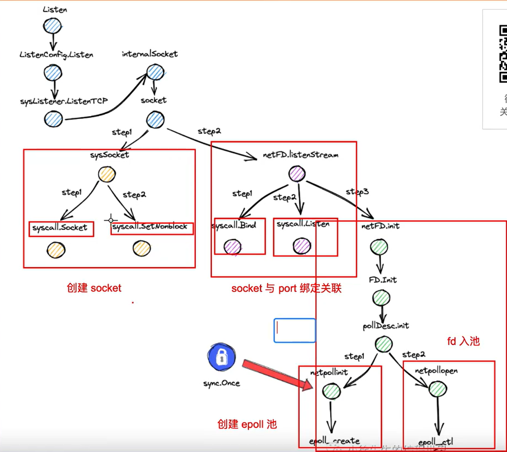
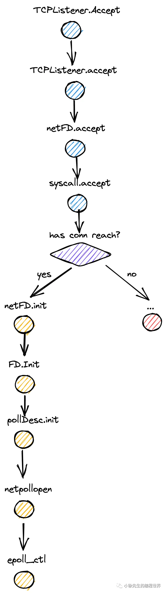
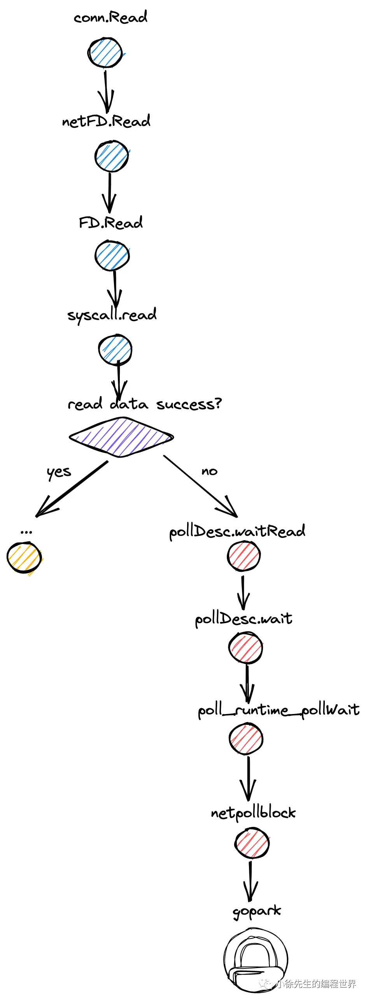
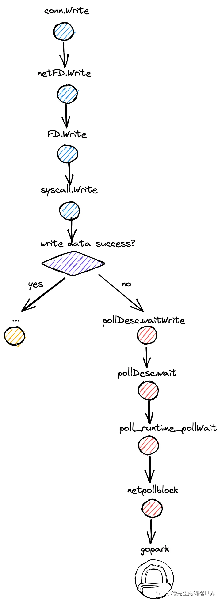

## 前言


## IO 多路复用概念
+ 多路：存在多个待服务的对象
+ 复用：只由一个执行单元提供服务

多路复用指的是，由一个执行单元，同时对多个对象提供服务，形成一对多的服务关系.

+ 多路：存在多个需要处理 io event 的 fd（linux 中，一切皆文件，所有事物均可抽象为一个文件句柄 file descriptor，简称 fd）
+ 复用：复用一个 loop thread 同时为多个 fd 提供处理服务（线程 thread 是内核视角下的最小调度单位；多路复用通常为循环模型 loop model，因此称为 loop thread）

### IO 多路复用的简单实现
#### 阻塞IO
```go
// 多个待服务的 fd 
    fds = [fd1,fd2,fd3,...]
    // 遍历 fd 列表，末尾和首部相连，形成循环
    i = 0
    for {
       // 获取本轮待处理的 fd
       fd = fds[i]        
       // 从 fd 中读数据
       data = read(fd)  
       // 处理数据 
       handle(data)             
       // 推进遍历
       i++
       if i == len(fds){
         i = 0
       }
    }
```
+ 定义了待处理的 fds 列表（多路）
+ 循环遍历 fds 列表，每轮负责读一个 fd（复用）

上述实现存在一个致命的问题，那就是句柄 fd 默认的 io 操作是阻塞型的，因此倘若在读 fd1 的时候，io event 没到达，那么 loop thread 就会陷入阻塞，后续 fd2、fd3 哪怕有 io event 到达，也无法得到执行.

#### 非阻塞IO
基于 BIO 存在的问题，我们进行一轮改进，核心是将 read 操作由同步阻塞操作改为带有尝试性的非阻塞操作. 在读一个 fd 的时候，倘若 io event 已就绪就正常读取，否则就即时返回并抛出一个特定类型的错误，让 loop thread 能够正常执行下去，为其他 fd 提供服务.


+ 定义了待处理的 fds 列表
+ 遍历 fds 列表，每轮尝试从一个 fd 中读数据
+ 倘若 io event 已就绪，则正常处理结果
+ 倘若 io event 未就绪，只抛出错误，同样不阻塞流程
+ 小睡一会儿，然后继续推进流程

但这里仍然存在问题，就是每轮处理之间的休眠时间. 倘若在休眠期间，fd 中有 io event 到达，就无法被正常处理，这同样是一种不好的体验.

倘若把此处的休眠操作去除了如何？

答案是同样有问题. 倘若不限制轮询的执行频率，那么不轮 fd 中是否有 io event，程序都会一直高强度运行，这会导致 CPU 空转，造成很大程度的资源浪费.

这就需要引入操作系统内核的帮助，通过几个内核对外暴露的接口，来进行 IO 多路复用的优雅实现，做到真正意义上的“随叫随到”.

### 多路复用的优雅实现


#### select

+ 一次可以处理多个 fd，体现多路. 但 fd 数量有限，最多 1024 个
+ loop thread 通过 select 将一组 fd 提交到内核做监听
+ 当 fd 中无 io event 就绪时，loop thread 会陷入阻塞
+ 每当这组 fd 中有 io event 到达时，内核会唤醒 loop thread
+ loop thread 无法精准感知到哪些 fd 就绪，需要遍历一轮 fd 列表，时间复杂度 O(N)
+ 托付给内核的 fd 列表只具有一轮交互的时效. 新的轮次中，loop thread 需要重新将监听的 fd 列表再传递给内核一次

#### epoll
+ 每次处理的 fd 数量无上限
+ loop thread 通过 epoll_create 操作创建一个 epoll 池子
+ loop thread 通过 epoll_ctl 每次将一个待监听的 fd 添加到 epoll 池中
+ 每当 fd 列表中有 fd 就绪事件到达时，会唤醒 loop thread. 同时内核会将处于就绪态的 fd 直接告知 loop thread，无需额外遍历


select 和 epoll 等多路复用操作利用了内核的能力，能在待监听 fd 中有 io event 到达时，将 loop thread 唤醒，避免无意义的主动轮询操作.

epoll 相比于 select 的核心性能优势在于：
+ loop thread 被唤醒时，能明确知道哪些 fd 需要处理，减少了一次额外遍历的操作，时间复杂度由 O(N) 优化到 O(1)
+ epoll 通过将创建池子和添加 fd 两个操作解耦，实现了开辟好的池中 fd 数据的复用，减少了用户态与内核态间的数据拷贝成本

## Event Poll 实现原理
### 核心指令
#### （1）epoll_create
在内核开辟空间，创建一个 epoll 池子用于批量存储管理 fd，后续可以通过 epoll_ctl 往池子中增删改 fd.
```go
func epollcreate1(flags int32) int32
```

#### （2）epoll_ctl
在某个 epoll 池子中进行一个 fd 的增删改操作.

正是由于 epoll 中将 epoll_ctl 与 epoll_create 操作进行了解耦，才实现了对 epoll_create 时传递的 fd 数据的复用，减少了用户态和内核态之间对 fd 数据的重复传递

此外，在 epoll_ctl 实现时，也需要通过 epollevent 设置好回调事件，当 fd 有指定事件到达时，会被添加到就绪队列中，最终将 loop thread 唤醒.

```go
func epollctl(epfd, op, fd int32, ev *epollevent) int32
type epollevent struct {
    events uint32
    data   [8]byte // unaligned uintptr
}
```

#### （3）epoll_wait
从对应 epoll 池子中获取就绪的 epollevent，（如果没有的话，会因此陷入阻塞），从中可以关联到对应的 fd 和 loop thread 信息.

### 数据结构
#### （1）epoll 池红黑树
实现 epoll 池的数据结构采用的是红黑树（Red-Black Tree，一种自平衡二叉查找树）实现，保证了所有增、删、改操作的平均时间复杂度维持在 O(logN) 的对数级水平.

为什么不采用hashmap作为数据结构进行存储？
+  hashmap随着数量激增，需要一个渐近式扩容的流程，扩容比较复杂，扩容后如果缩容需要巨大成本
+ 监听的事件作为key，事件下有哪些fd或者loop thread作为value。在查询上红黑树比hashmap更加灵活，以二维复合键的形式
+ 时间复杂度更优，红黑树的查询时间复杂度为O(logN)，hashmap的查询时间复杂度为O(1)

#### （2）就绪事件队列
针对于 fd 的就绪 io event，由于通常数量有限，且每个事件都需要逐一处理，没有优先级之分，因此采用简单的双向链表实现即可.


### 事件回调机制
+ 在loop thread创建好对应的epoll池，添加好对应的fd和事件类型后，在调用epoll_wait后，会陷入一个被动阻塞，释放出对应的cpu资源

+ 通过内核感知到 io event 事件的动态，令 loop thread 在合适的时机阻塞，避免浪费 CPU；在合适的时机执行，及时处理 io event.

+ 在 io event 就绪时，会精准地将真正就绪的 fd 传递到 loop thread 手中，减少了一次无意义的遍历查询动作.


事件回调的注册是在调用 epoll_ctl 添加 fd 时，此时会提前设置好对这个 fd 关心的事件类型，当对应的 io event 真的发生时，内核会将该 fd 和对应的 loop thread 封装到 epollevent 中，添加到就绪队列 ready list 当中.之后当用户调用 epoll_wait 时，能够准确地获取到这部分就绪的 epollevent，进而能够将对应的 loop thread 唤醒.


## epoll golang中的应用
### 启动TCP服务器
```go
// 启动一个 tcp 服务端代码示例
func main(){
   // 创建一个 tcp 端口监听器
   // Listen底层会调用epoll_create创建一个epoll池，调用epoll_ctl向池子中添加监听的fd
   l,_ := net.Listen("tcp",":8080")
   // 主动轮询模型
   for{
       // 等待 tcp 连接到达
       // Accept底层会调用epoll_wait等待fd就绪事件，如果没有事件的到来，把当前主线的loop thread对应的goroutine阻塞，避免在无cpu情况下持续地空转，浪费cpu的资源
       // 阻塞和等待请求到来，额外的执行epoll_ctrl指令，将这个到来的连接看作是fd，连接添加到创建好的epoll池中，注册对应的连接看有没有数据到来。
       conn,_ := l.Accept()     
       // 开启一个 goroutine 负责一笔客户端请求的处理
       go serve(conn)
   }
}


// 处理一笔 tcp 连接
func serve(conn net.Conn){
    defer conn.Close()
    var buf []byte
    // 读取连接中的数据
    // Read中会调用epoll_wait等待fd就绪事件，如果连接中数据到来，将数据读到缓存的buf字节数组中，否则当前的goroutine（读取连接数据做出响应的）陷入阻塞
    _,_ = conn.Read(buf)    
    // ...
}
```
+ 创建了一个 tcp 端口监听器 listener
+ 通过 for 循环建立主动轮询模型
+ 每轮尝试从 listener 中获取到达的 tcp 连接
+ 倘若成功取到连接，则 1:1启动一个 goroutine 异步处理连接的请求
+ 倘若无连接到达，则阻塞主流程
其中，有两个方法是核心入口：一个是创建 Listener 的 net.Listen；另一个是从 Listener 获取连接的 Listener.Accept 方法.

### 创建 TCP 端口监听器


#### （1）创建 Listener 前处理
在创建 TCP 端口 Listener 时，首先历经 Listen -> ListenerConfig.Listen -> sysListener.listenTCP -> internetSocket -> socket 方法的辗转，最终来到位于 runtime/sock_posix.go 的 socket 方法中，开始执行套接字 socket 的创建和初始化.


#### （2）创建 socket
在 socket 方法中首先，在 sysSocket 方法中，发起两次系统调用：

+ syscall.Socket 创建套接字
+ syscall.SetNonblock 将 socket 设置为非阻塞模式
然后步入 netFD.listenStream 方法，将 socket fd 和端口进行绑定和监听，然后调用 epoll 指令设定 io 多路复用模式.
```go
func socket(ctx context.Context, net string, family, sotype, proto int, ipv6only bool, laddr, raddr sockaddr, ctrlFn func(string, string, syscall.RawConn) error) (fd *netFD, err error) {
    // 创建一个 socket 套接字
    s, err := sysSocket(family, sotype, proto)   
    // ...
    // 绑定、监听端口，并对 socket fd 进行初始化. epoll_create 和 epoll_ctl 执行的执行正是在初始化的流程中.
    fd.listenStream(laddr, listenerBacklog(), ctrlFn)
    // ...
}
```
```go
// socketFunc 宏指令，关联执行系统调用 syscall.Socket 创建套接字
var socketFunc        func(int, int, int) (int, error)  = syscall.Socket

func sysSocket(family, sotype, proto int) (int, error) {
    // 通过系统调用创建一个 socket
    s, err = socketFunc(family, sotype, proto)
    // 通过系统调用将 socket 设置为非阻塞模式
    syscall.SetNonblock(s, true)
    // ...
}
```

#### （3）绑定、监听端口
在 netFD.listenStream 方法中

+ 发起系统调用 syscall.Bind 实现 socket fd 和端口的绑定
+ 发起系统调用，实现对 fd 的监听
+ 调用 netFD.init 方法对 socket fd 进行初始化
```go
// listenFunc 宏指令，关联执行系统调用 syscall.Listen 监听端口
var listenFunc        func(int, int) error              = syscall.Listen

func (fd *netFD) listenStream(laddr sockaddr, backlog int, ctrlFn func(string, string, syscall.RawConn) error) error {
    // ...
    // 调用 bind 系统调用，将 socket fd 和端口进行绑定
    syscall.Bind(fd.pfd.Sysfd, lsa)
    // 通过宏指令调用 listen 系统调
    listenFunc(fd.pfd.Sysfd, backlog)
    // 初始化 socket fd，在其中执行了 epoll 操作
    fd.init()
    // ...
}
```
```go
func (fd *netFD) init() error {
    return fd.pfd.Init(fd.net, true)
}
 
func (fd *FD) Init(net string, pollable bool) error {
    // ...
    fd.pd.init(fd)
    // ...
}
```

#### （4）创建 epoll 池
从 netFD.init 方法出发，历经 netFD.init -> FD.Init -> pollDesc.init 的链路，最终在 pollDesc.init 方法中，通过 sync.Once 保证全局只执行一次 runtime_pollServerInit 方法作 epoll 池的初始化.
```go
var serverInit sync.Once

func (pd *pollDesc) init(fd *FD) error {
    serverInit.Do(runtime_pollServerInit)
    ctx, errno := runtime_pollOpen(uintptr(fd.Sysfd))
    // ...
}
```
runtime_pollServerInit 方法最终会编译关联到位于 runtime/netpoll_epoll.go 文件的 netpollinit 方法，可以看到在方法中，通过调用 epollcreate1 方法，执行了 epoll 指令完成了 epoll 池的创建.
```go
func netpollinit() {
    // 执行 epoll_create 执行，开辟一块 epoll 池
    epfd = epollcreate1(_EPOLL_CLOEXEC)
    // ...
}
```

#### （5）socket fd 入池
在 pollDesc.init 方法确保全局完成一次 epoll 池的创建后，会调用 runtime_pollOpen 方法将当前 fd 添加到 epoll 池中.

runtime_pollOpen 方法最终会编译关联到位于 runtime/netpoll_epoll.go 文件的 netpollopen 方法，其中会调用 epollctl 指令，完成 socket fd 的入池操作

```go
func netpollopen(fd uintptr, pd *pollDesc) int32 {
    // 将待监听的 socket fd 添加到 epoll 池中，并注册好回调路径
    var ev epollevent
    ev.events = _EPOLLIN | _EPOLLOUT | _EPOLLRDHUP | _EPOLLET
    *(**pollDesc)(unsafe.Pointer(&ev.data)) = pd    
    return -epollctl(epfd, _EPOLL_CTL_ADD, int32(fd), &ev)
}
```
### 获取 TCP 连接


#### （1）获取 tcp 连接前处理
在创建好 Listener 后，接下来调用 Listener.Accept 方法，可以实现有 tcp 连接就绪时会取得连接；无 tcp 连接时令当前 goroutine 陷入阻塞的效果.

历经 TCPListener.Accept -> TCPListener.accept -> netFD.accept -> FD.Accept 的辗转，最终获取 tcp 连接及阻塞处理的核心逻辑实现于 internal/poll/fd_unix.go 的 FD.Accept 方法.

```go
func (fd *netFD) accept() (netfd *netFD, err error) {
    // 倘若有 tcp 连接到达，则成功取出并返回
    // 倘若没有 tcp 连接到达，会 gopark 进入被动阻塞，等待被唤醒
    d, rsa, errcall, err := fd.pfd.Accept()
    // ...
}
```

#### （2）尝试获取 tcp 连接
在 FD.Accept 方法中：

+ 首先调用 accept 方法，会通过系统调用 syscall.Accept 以非阻塞模式尝试获取一次对应 socket fd 下到达的 tcp 连接
+ 倘若没有就绪的 tcp 连接，会抛出 syscall.EAGAIN 错误，此时会走入 pollDesc.waitRead 分支，最终通过 gopark 操作令当前 goroutine 陷入被动阻塞状态
```go
func (pd *pollDesc) wait(mode int, isFile bool) error {
    // ...
    res := runtime_pollWait(pd.runtimeCtx, mode)
    // ...
}
```

#### （3）被动阻塞 goroutine
历经 pollDesc.waitRead -> pollDesc.wait -> poll_runtime_pollWait 的链路，最终会在 netpollblock 方法中，通过 gopark 操作，令求 tcp 连接而不得的 loop goroutine 陷入被动阻塞状态.
```go
func netpollblock(pd *pollDesc, mode int32, waitio bool) bool {
    // ...
    if waitio || netpollcheckerr(pd, mode) == pollNoError {
        // 调用 gopark 被动阻塞挂起
        gopark(netpollblockcommit, unsafe.Pointer(gpp), waitReasonIOWait, traceEvGoBlockNet, 5)
    }
    // ...
}
```

### 处理 TCP 连接
当 loop goroutine 获取到 tcp 连接时

#### （1）conn fd 入池


在位于 internal/poll/sock_cloexec.go 的 netFD.accept 方法中，倘若通过系统调用 syscall.Accept 成功获取到了到达的 tcp 连接，则会将其封装为一个 netFD，并通过 epoll_ctl 指令将该 fd 添加到 epoll 池中，注册好对应的关心的事件，实现对 read 事件的监听.
```go
func (fd *netFD) accept() (netfd *netFD, err error) {
    // 调用 accept 系统调用，接收 tcp 连接
    d, rsa, errcall, err := fd.pfd.Accept()
    // 将 connet fd 封装成 netfd
    netfd, err = newFD(d, fd.family, fd.sotype, fd.net)
    // 对 netfd 进行初始化，底层会调用 epoll_ctl 将其注册到 listener 对应的 epoll 池中 
    netfd.init()
    // ...
}
```
```go
func (pd *pollDesc) init(fd *FD) error {
    serverInit.Do(runtime_pollServerInit)
    ctx, errno := runtime_pollOpen(uintptr(fd.Sysfd))
    // ...
}
```
单例工具，调用runtime_pollServerInit方法，完成 epoll 池的创建（在创建TCP端口监听器，调用net.Listen方法已经完成过对epoll池的创建），则该单例工具会保护当前执行的流程


#### （2）读 tcp 连接数据

获取到 tcp 连接后，在缓存区数据未就绪时，用户执行 read 操作同样会陷入阻塞，对应的方法链路如下：
```go
func (fd *netFD) Read(p []byte) (n int, err error) {
    n, err = fd.pfd.Read(p)
    // ...
}
```

在位于 internal/poll/fd_unix.go 的 FD.Read 方法中，会执行 syscall.Read 尝试从 conn fd 中读取数据，倘若数据未就绪，则会抛出 EAGAIN error，此时会调用 pollDesc.waitRead 方法将当前的 loop read goroutine 挂起
```go
func netpollblock(pd *pollDesc, mode int32, waitio bool) bool {
    // ...
    if waitio || netpollcheckerr(pd, mode) == pollNoError {
        // 调用 gopark 被动阻塞挂起
        gopark(netpollblockcommit, unsafe.Pointer(gpp), waitReasonIOWait, traceEvGoBlockNet, 5)
    }
    // ...
}
```

###  TCP 连接写入数据


向 tcp 连接中写入数据的流程基本和 3.4 小节第（2）部分从 tcp 连接读取数据的链路形成对仗.

在位于 internal/poll/fd_unix.go 的 FD.Write 方法，会执行系统调用 syscall.Write，尝试将数据写入 tcp 连接的缓冲区. 倘若当前缓冲区已经没有剩余的空间，则会抛出 EAGAIN 错误，然后执行 pollDesc.waitWrite，最终执行 gopark 操作将当前 loop write goroutine 挂起.

```go
func (fd *FD) Write(p []byte) (int, error) {
    // ...
    var nn int
    for {
        max := len(p)
        // ...
        n, err := ignoringEINTRIO(syscall.Write, fd.Sysfd, p[nn:max])
        // ...
        if err == syscall.EAGAIN && fd.pd.pollable() {
            fd.pd.waitWrite(fd.isFile);
        }
        // ...
    }
}
```

```go
func netpollblock(pd *pollDesc, mode int32, waitio bool) bool {
    // ...
    if waitio || netpollcheckerr(pd, mode) == pollNoError {
        // 调用 gopark 被动阻塞挂起
        gopark(netpollblockcommit, unsafe.Pointer(gpp), waitReasonIOWait, traceEvGoBlockNet, 5)
    }
    // ...
}
```

### 唤醒 IO 阻塞协程
当 io event 未就绪时，会在位于 runtime/netpoll.go 的 poll_runtime_pollWait 方法中执行 gopark 操作，令当前的 loop goroutine 陷入被动阻塞状态.

这些 goroutine 将会在什么时机得到唤醒的机会.

#### （1）全局监控任务 sysmon

在位于 runtime/proc.go 的 main 函数中，会单独启动一个 m（GMP中对线程的抽象 M），用于执行 sysmon 监控任务

```go
func main() {
    // ...
    systemstack(func() {
        newm(sysmon, nil, -1)
    })  
    // ... 
}
```
在 sysmon 函数中，会每隔 10ms 调用 netpoll 函数，尝试取出 io event 已到达的 loop goroutine，进行唤醒操作.

```go
func sysmon() {
    // ...
    for {        
        // 每 10 ms 周期性执行一次
        lastpoll := int64(atomic.Load64(&sched.lastpoll))
        if netpollinited() && lastpoll != 0 && lastpoll+10*1000*1000 < now {
            atomic.Cas64(&sched.lastpoll, uint64(lastpoll), uint64(now))
            // 取出就绪的 loop goroutine
            list := netpoll(0) 
            // ...
            // 唤醒 list 中的 goruotine
            injectglist(&list)
        }
        // ...
    }
}
```

netpoll 方法位于 runtime/net_epoll.go 文件，方法中会基于非阻塞模式调用 epollwait 方法，获取到就绪事件队列 events，然后遍历事件队列，调用 netpollready 方法将对应的 loop goroutine 添加到 gList 中返回给上层用于执行唤醒操作.

```go
func netpoll(delay int64) gList {
    // ...
    var events [128]epollevent
retry:
    // 非阻塞调用 epoll_wait，接收到就绪的事件列表
    n := epollwait(epfd, &events[0], int32(len(events)), waitms)
    // ...
    var toRun gList
    for i := int32(0); i < n; i++ {
        ev := &events[i]
        // 添加关心的事件模式
        var mode int32
        if ev.events&(_EPOLLIN|_EPOLLRDHUP|_EPOLLHUP|_EPOLLERR) != 0 {
            mode += 'r'
        }
        if ev.events&(_EPOLLOUT|_EPOLLHUP|_EPOLLERR) != 0 {
            mode += 'w'
        }
        // 从 event 中获取已就绪的 fd，调用 netpollready 方法将 fd 添加到 gList 中用于返回，在上层进行唤醒和执行
        if mode != 0 {
            pd := *(**pollDesc)(unsafe.Pointer(&ev.data))
            pd.setEventErr(ev.events == _EPOLLERR)
            netpollready(&toRun, pd, mode)
        }
    }
    return toRun
}
```
```go
func netpollready(toRun *gList, pd *pollDesc, mode int32) {
    var rg, wg *g
    if mode == 'r' || mode == 'r'+'w' {
        rg = netpollunblock(pd, 'r', true)
    }
    if mode == 'w' || mode == 'r'+'w' {
        wg = netpollunblock(pd, 'w', true)
    }
    // 将 read、write 的就绪 fd 对应的 goroutine 中，添加到 toRun 链表中
    if rg != nil {
        toRun.push(rg)
    }
    if wg != nil {
        toRun.push(wg)
    }
}
```

#### （2）GMP 调度主流程
可查看GMP调度原理  * [go-GMP](/study/GoLang/go-基础原理/GMP实现原理)

在 GMP 主流程方法 schedule 中，在每轮调度中，g0 都会调用 findrunnable 为当前 P 寻找下一个可执行的 goroutine. 此时当 P 本地队列和全局队列都没有待执行的 goroutine 时，则会尝试获取就绪的 loop goroutine 用于执行.
```go
func findrunnable() (gp *g, inheritTime bool) {
    // ...
    if netpollinited() && atomic.Load(&netpollWaiters) > 0 && atomic.Load64(&sched.lastpoll) != 0 {
        if list := netpoll(0); !list.empty() { // non-blocking
            gp := list.pop()
            injectglist(&list)
            casgstatus(gp, _Gwaiting, _Grunnable)
            //... 
            return gp, false
        }
    }
    // ...
}
```

#### （3）GC start the world
在 GC 过程中，每次调用完 stop the world 之后，都会对仗调用 start the world 重启世界，此时也会对就绪的 loop goroutine 执行唤醒操作.
```go
func startTheWorldWithSema(emitTraceEvent bool) int64 {
   // ...
    if netpollinited() {
        list := netpoll(0) // non-blocking
        // 唤醒 list 中的 goruotine
        injectglist(&list)
    }
    // ...
}
```
## 总结
+ 基于伪代码推演了 IO 多路复用的实现思路，核心是基于主动轮询+非阻塞 IO 模式实现，但真正的优雅实现需要依赖于内核，这是因为用户态始终无法准确感知到 io event 的情报
+ 聊了 epoll 技术的实现原理：（1）拆解建池接口 epoll_create 和入池接口 epoll_ctl，实现 fd 一次拷贝多次复用；（2）通过红黑树维护池中的 fd 数据，增删改平均复杂度 O(logN)；（3）精准事件回调，准确告知 loop thread 具体哪些 fd 已就绪
+ 走读了 Golang 底层 IO 模型的代码链路，Golang 在创建 Listener、获取 conn、读 conn 和 写 conn 时都涉及到对 epoll 技术的应用.