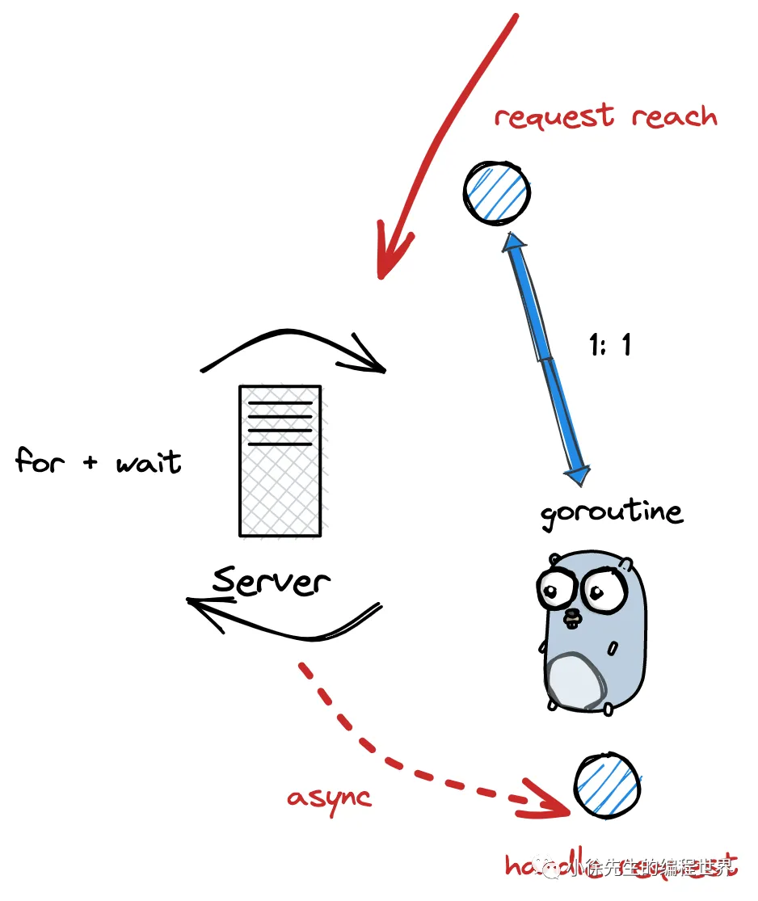
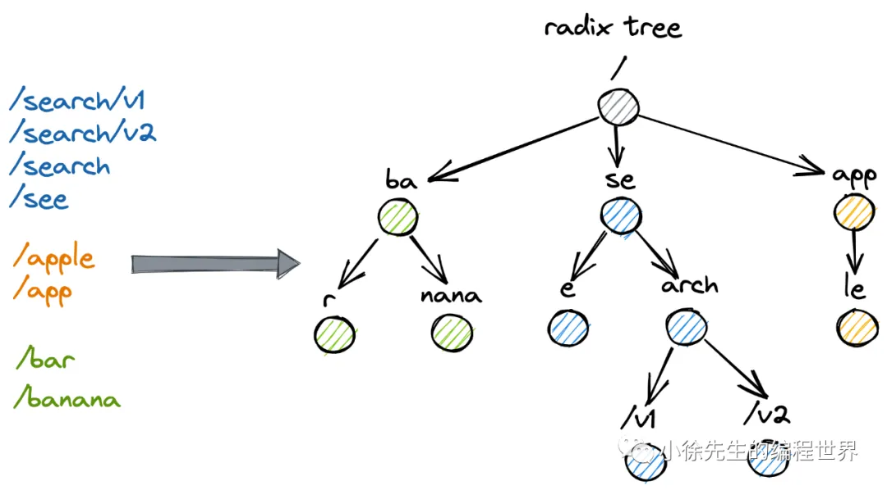
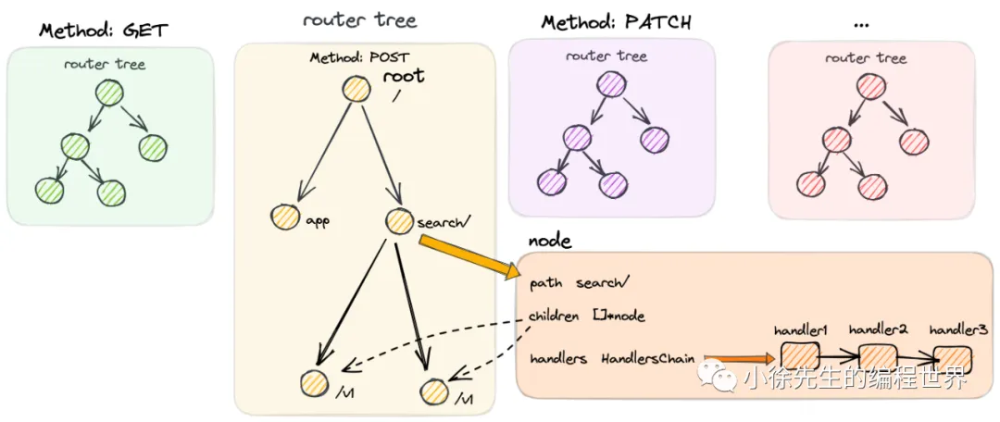

# gin框架原理
• 支持中间件操作（ handlersChain 机制 ）
• 更方便的使用（ gin.Context ）
• 更强大的路由解析能力（ radix tree 路由树 ）

## Gin 与 net/http 的关系

在 net/http 的既定框架下，gin 所做的是提供了一个 gin.Engine 对象作为 Handler 注入其中，从而实现路由注册/匹配、请求处理链路的优化.

## 注册handler的流程

### 核心数据结构


#### （1）gin.Engine
```go
type Engine struct {
   // 路由组
    RouterGroup
    // ...
    // context 对象池
    pool             sync.Pool
    // 方法路由树
    trees            methodTrees
    // ...
}
```

```go
// net/http 包下的 Handler interface
type Handler interface {
    ServeHTTP(ResponseWriter, *Request)
}


func (engine *Engine) ServeHTTP(w http.ResponseWriter, req *http.Request) {
    // ...
}
```
Engine 为 Gin 中构建的 HTTP Handler，其实现了 net/http 包下 Handler interface 的抽象方法： Handler.ServeHTTP，因此可以作为 Handler 注入到 net/http 的 Server 当中.

+ 路由组 RouterGroup：
+ Context 对象池 pool：基于 sync.Pool 实现，作为复用 gin.Context 实例的缓冲池.
+ 路由树数组 trees：共有 9 棵路由树，对应于 9 种 http 方法. 路由树基于压缩前缀树实现，

#### （2）RouterGroup
```go
type RouterGroup struct {
    Handlers HandlersChain
    basePath string
    engine *Engine
    root bool
}
```
+ Handlers：路由组共同的 handler 处理函数链. 组下的节点将拼接 RouterGroup 的公用 handlers 和自己的 handlers，组成最终使用的 handlers 链
+ basePath：路由组的基础路径. 组下的节点将拼接 RouterGroup 的 basePath 和自己的 path，组成最终使用的 absolutePath
+ engine：指向路由组从属的 Engine
+ root：标识路由组是否位于 Engine 的根节点. 当用户基于 RouterGroup.Group 方法创建子路由组后，该标识为 false


#### （3）HandlersChain
```go
type HandlersChain []HandlerFunc
type HandlerFunc func(*Context)
```
HandlersChain 是由多个路由处理函数 HandlerFunc 构成的处理函数链. 在使用的时候，会按照索引的先后顺序依次调用 HandlerFunc.

### 流程入口
```go
func main() {
    // 创建一个 gin Engine，本质上是一个 http Handler
    mux := gin.Default()
    // 注册中间件
    mux.Use(myMiddleWare)
    // 注册一个 path 为 /ping 的处理函数
    mux.POST("/ping", func(c *gin.Context) {
        c.JSON(http.StatusOK, "pone")
    })
    // ...
}
```

### 初始化Engine
方法调用：gin.Default -> gin.New

+ 创建一个 gin.Engine 实例
+ 创建 Enging 的首个 RouterGroup，对应的处理函数链 Handlers 为 nil，基础路径 basePath 为 "/"，root 标识为 true
+ 构造了 9 棵方法路由树，对应于 9 种 http 方法
+ 创建了 gin.Context 的对象池

```go
func Default() *Engine {
    engine := New()
    // ...
    return engine
}

func New() *Engine {
    // ...
    // 创建 gin Engine 实例
    engine := &Engine{
        // 路由组实例
        RouterGroup: RouterGroup{
            Handlers: nil,
            basePath: "/",
            root:     true,
        },
        // ...
        // 9 棵路由压缩前缀树，对应 9 种 http 方法
        trees:                  make(methodTrees, 0, 9),
        // ...
    }
    engine.RouterGroup.engine = engine     
    // gin.Context 对象池   
    engine.pool.New = func() any {
        return engine.allocateContext(engine.maxParams)
    }
    return engine
}
```

### 注册 middleware
通过 Engine.Use 方法可以实现中间件的注册，会将注册的 middlewares 添加到 RouterGroup.Handlers 中. 后续 RouterGroup 下新注册的 handler 都会在前缀中拼上这部分 group 公共的 handlers.


以 http post 为例，注册 handler 方法调用顺序为 RouterGroup.POST-> RouterGroup.handle，接下来会完成三个步骤：

+ 拼接出待注册方法的完整路径 absolutePath
+ 拼接出代注册方法的完整处理函数链 handlers
+ 以 absolutePath 和 handlers 组成 kv 对添加到路由树中

```go
func (group *RouterGroup) POST(relativePath string, handlers ...HandlerFunc) IRoutes {
    return group.handle(http.MethodPost, relativePath, handlers)
}
func (group *RouterGroup) handle(httpMethod, relativePath string, handlers HandlersChain) IRoutes {
    absolutePath := group.calculateAbsolutePath(relativePath)
    handlers = group.combineHandlers(handlers)
    group.engine.addRoute(httpMethod, absolutePath, handlers)
    return group.returnObj()
}
```
#### （1）完整路径拼接
结合 RouterGroup 中的 basePath 和注册时传入的 relativePath，组成 absolutePath

```go
func (group *RouterGroup) calculateAbsolutePath(relativePath string) string {
    return joinPaths(group.basePath, relativePath)
}
 
func joinPaths(absolutePath, relativePath string) string {
    if relativePath == "" {
        return absolutePath
    }


    finalPath := path.Join(absolutePath, relativePath)
    if lastChar(relativePath) == '/' && lastChar(finalPath) != '/' {
        return finalPath + "/"
    }
    return finalPath
}
```
#### （2）完整 handlers 生成
深拷贝 RouterGroup 中 handlers 和注册传入的 handlers，生成新的 handlers 数组并返回
```go
func (group *RouterGroup) combineHandlers(handlers HandlersChain) HandlersChain {
    finalSize := len(group.Handlers) + len(handlers)
    assert1(finalSize < int(abortIndex), "too many handlers")
    mergedHandlers := make(HandlersChain, finalSize)
    copy(mergedHandlers, group.Handlers)
    copy(mergedHandlers[len(group.Handlers):], handlers)
    return mergedHandlers
}
```
#### （3）注册 handler 到路由树
+ 获取 http method 对应的 methodTree
+ 将 absolutePath 和对应的 handlers 注册到 methodTree 中
```go
func (engine *Engine) addRoute(method, path string, handlers HandlersChain) {
    // ...
    root := engine.trees.get(method)
    if root == nil {
        root = new(node)
        root.fullPath = "/"
        engine.trees = append(engine.trees, methodTree{method: method, root: root})
    }
    root.addRoute(path, handlers)
    // ...
}
```

## 启动服务流程
### 流程入口
```go
func main() {
    // 创建一个 gin Engine，本质上是一个 http Handler
    mux := gin.Default()
    
    // 一键启动 http 服务
    if err := mux.Run(); err != nil{
        panic(err)
    }
}
```
### 启动服务
一键启动 Engine.Run 方法后，底层会将 gin.Engine 本身作为 net/http 包下 Handler interface 的实现类，并调用 http.ListenAndServe 方法启动服务.
```go
func (engine *Engine) Run(addr ...string) (err error) {
    // ...
    err = http.ListenAndServe(address, engine.Handler())
    return
}
```
ListenerAndServe 方法本身会基于主动轮询 + IO 多路复用的方式运行，因此程序在正常运行时，会始终阻塞于 Engine.Run 方法，不会返回



### 处理请求

在服务端接收到 http 请求时，会通过 Handler.ServeHTTP 方法进行处理. 而此处的 Handler 正是 gin.Engine，其处理请求的核心步骤如下：

+ 对于每笔 http 请求，会为其分配一个 gin.Context，在 handlers 链路中持续向下传递
+ 调用 Engine.handleHTTPRequest 方法，从路由树中获取 handlers 链，然后遍历调用
+ 处理完 http 请求后，会将 gin.Context 进行回收. 整个回收复用的流程基于对象池管理

```go
func (engine *Engine) ServeHTTP(w http.ResponseWriter, req *http.Request) {
    // 从对象池中获取一个 context
    c := engine.pool.Get().(*Context)
    
    // 重置/初始化 context
    c.writermem.reset(w)
    c.Request = req
    c.reset()
    
    // 处理 http 请求
    engine.handleHTTPRequest(c)


    // 把 context 放回对象池
    engine.pool.Put(c)
}
```

Engine.handleHTTPRequest 方法核心步骤分为三步：

+ 根据 http method 取得对应的 methodTree
+ 根据 path 从 methodTree 中找到对应的 handlers 链
+ 将 handlers 链注入到 gin.Context 中，通过 Context.Next 方法按照顺序遍历调用 handler

```go
func (engine *Engine) handleHTTPRequest(c *Context) {
    httpMethod := c.Request.Method
    rPath := c.Request.URL.Path
    
    // ...
    t := engine.trees
    for i, tl := 0, len(t); i < tl; i++ {
        // 获取对应的方法树
        if t[i].method != httpMethod {
            continue
        }
        root := t[i].root
        // 从路由树中寻找路由
        value := root.getValue(rPath, c.params, c.skippedNodes, unescape)
        if value.params != nil {
            c.Params = *value.params
        }
        if value.handlers != nil {
            c.handlers = value.handlers
            c.fullPath = value.fullPath
            c.Next()
            c.writermem.WriteHeaderNow()
            return
        }
        // ...
        break
    }
    // ...
}
```

## Gin的路由树
###  策略与原理

#### （1）前缀树
前缀树又称 trie 树，是一种基于字符串公共前缀构建索引的树状结构，核心点包括：

+ 除根节点之外，每个节点对应一个字符
+ 从根节点到某一节点，路径上经过的字符串联起来，即为该节点对应的字符串
+ 尽可能复用公共前缀，如无必要不分配新的节点
tries 树在 leetcode 上的题号为 208

#### （2）压缩前缀树
压缩前缀树又称基数树或 radix 树，是对前缀树的改良版本，优化点主要在于空间的节省，核心策略体现在：

倘若某个子节点是其父节点的唯一孩子，则与父节点进行合并


在 gin 框架中，使用的正是压缩前缀树的数据结构.

#### （3）为什么使用压缩前缀树
与压缩前缀树相对的就是使用 hashmap，以 path 为 key，handlers 为 value 进行映射关联，这里选择了前者的原因在于：

+ path 匹配时不是完全精确匹配，比如末尾 ‘/’ 符号的增减、全匹配符号 '*' 的处理等，map 无法胜任（模糊匹配部分的代码于本文中并未体现，大家可以深入源码中加以佐证）
+ 路由的数量相对有限，对应数量级下 map 的性能优势体现不明显，在小数据量的前提下，map 性能甚至要弱于前缀树
+ path 串通常存在基于分组分类的公共前缀，适合使用前缀树进行管理，可以节省存储空间

#### （4）补偿策略
在 Gin 路由树中还使用一种补偿策略，在组装路由树时，会将注册路由句柄数量更多的 child node 摆放在 children 数组更靠前的位置.（把挂载路径数量越多的子节点优先往左侧靠）

这是因为某个链路注册的 handlers 句柄数量越多，一次匹配操作所需要花费的时间就越长，且被匹配命中的概率就越大，因此应该被优先处理.


### 核心数据结构


```go
type methodTree struct {
    method string
    root   *node
}
```
node 是 radix tree 中的节点，对应节点含义如下：

+ path：节点的相对路径，拼接上 RouterGroup 中的 basePath 作为前缀后才能拿到完整的路由 path
+ indices：由各个子节点 path 首字母组成的字符串，子节点顺序会按照途径的路由数量 priority进行排序
+ priority：途径本节点的路由数量，反映出本节点在父节点中被检索的优先级
+ children：子节点列表
+ handlers：当前节点对应的处理函数链

```go
type node struct {
    // 节点的相对路径
    path string
    // 每个 indice 字符对应一个孩子节点的 path 首字母
    indices string
    // ...
    // 后继节点数量
    priority uint32
    // 孩子节点列表
    children []*node 
    // 处理函数链
    handlers HandlersChain
    // path 拼接上前缀后的完整路径
    fullPath string
}
```
###  注册到路由树
从路由树中匹配 path 对应 handler 的详细过程


