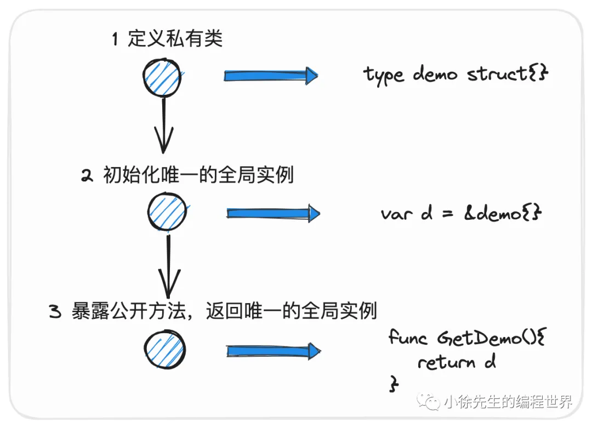
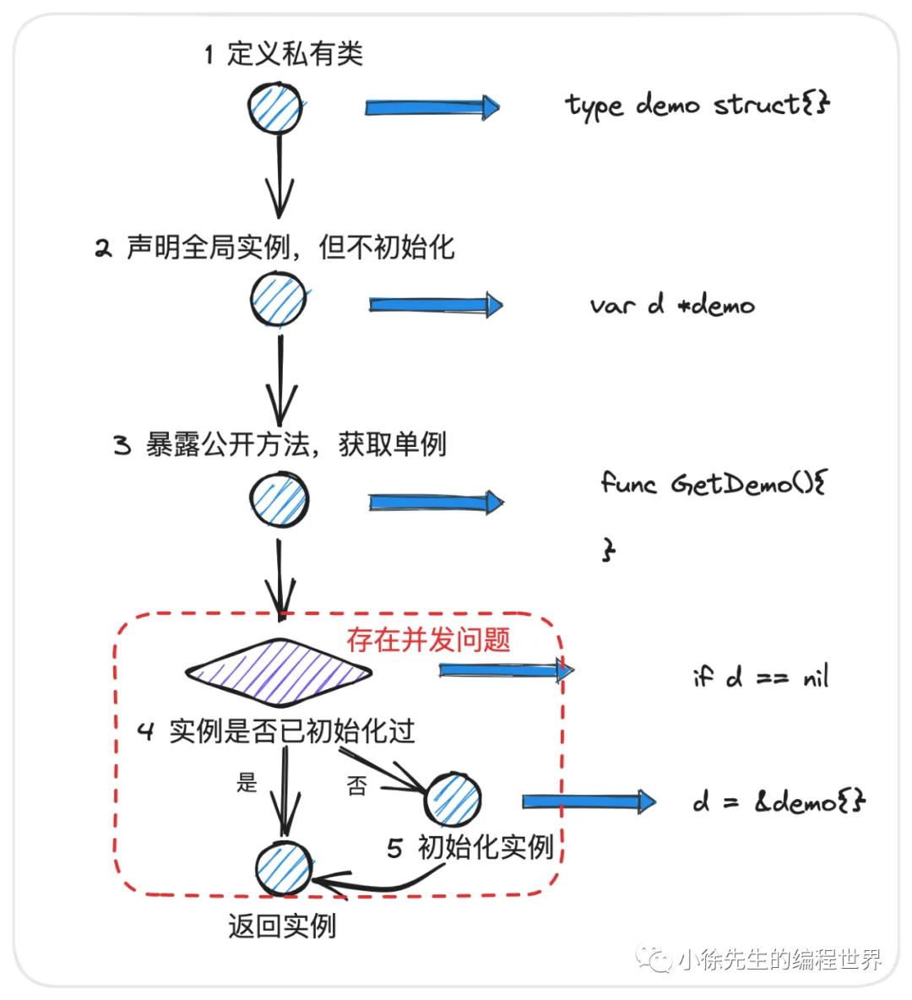
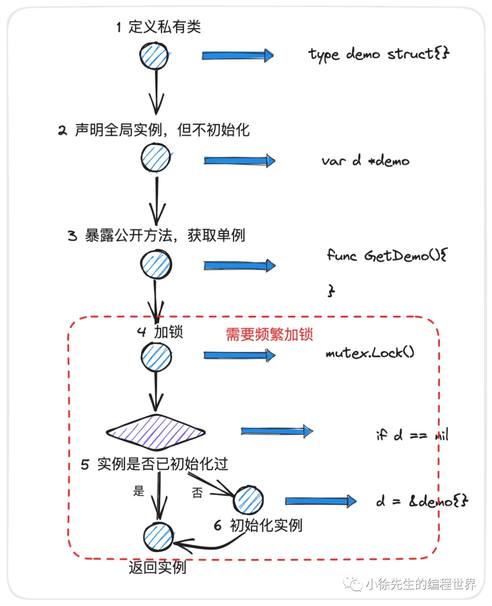
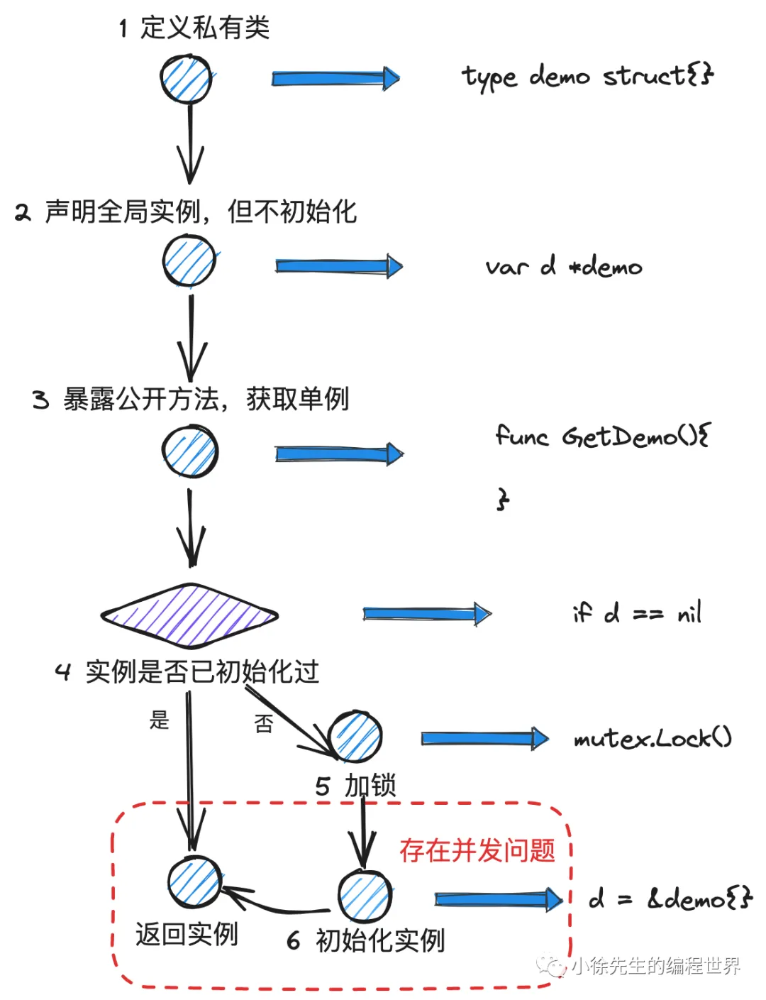
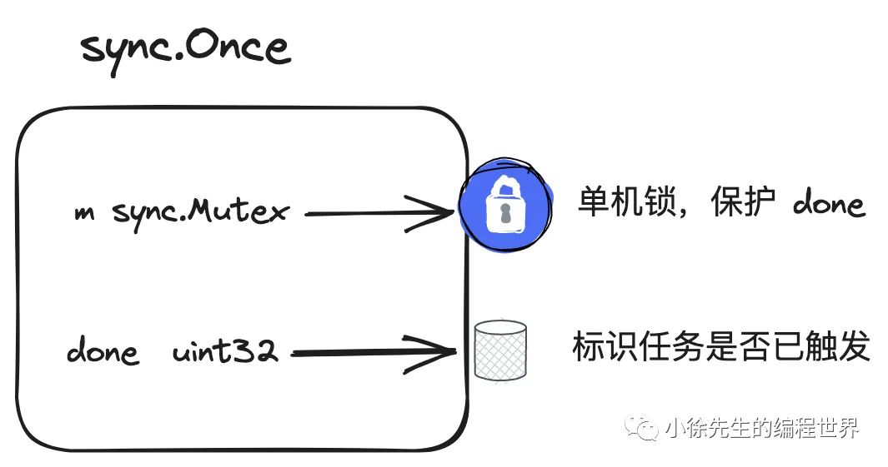

# 单例模式

## 单例模式背景
声明一个类并保证这个类只存在全局唯一的实例供外部反复使用
### 适用场景包括
+ 一些只允许存在一个实例的类，全局统一的监控统计模块
+ 实例化很耗费资源的类，比如协程池、连接池和第三方交互的客户端
    - 协程中复用资源，使用goroutine时有一个并发控制的概念，全局此时有多少goroutine，创建协程做一个容量的控制，使得超过一定数量的协程时，新来的协程陷入阻塞，并抛出错误，感知到使用协程的上限。如果不使用单例模式，则会创建新的协程池，则失去了资源共享的意义，因为每一个协程池有独立的容量控制，互相之间不能共享的。因此希望协程池为全局公共使用的
+ 一些入参繁杂、固定组件、全局构造出来的系统模块组件，controller、service、dao等

## 单例模式的实现
### 饿汉式
从一开始就完成单例的初始化工作，以备不时之需。

对于单例对象而言，不论其后续有没有被使用到以及何时才会被使用到，都会在程序启动之初完成其初始化工作.

+ 单例类和构造方法声明为不可导出类型，避免被外部直接获取到（避免让外界拥有直接初始化的能力，导致单例模式被破坏）

+ 在代码启动之初，就初始化好一个全局单一的实例，作为后续所谓的“单例”

+ 暴露一个可导出的单例获取方法 GetXXX()，用于返回这个单例对象


```go
package singleton

var s *singleton

func init() {
    s = newSingleton()
}

type singleton struct {
}

func newSingleton() *singleton {
    return &singleton{}
}

func (s *singleton) Work() string {
    return "I am a singleton"
}

func GetInstance() *singleton {
    return s
}
```

+ singleton 是需要被单例模式保护的类型

+ singleton 首字母小写，是不可导出的类型，避免被外界直接获取

+ 在包初始化函数 init 中完成了 singleton 单例的初始化工作

+ 对外暴露可导出方法 GetInstance，返回提前初始化好的全局单例对象 s

+ Work() 是单例对象的方法，用于测试单例模式是否正常工作


不建议这么做的原因主要在于：

+ singleton 是包内的不可导出类型，在包外即便获取到了，也无法直接作为方法的入参或者出参进行传递，显得很呆

+ singleton 的对外暴露，使得 singleton 所在 package 的代码设计看起来是自相矛盾的，混淆了 singleton 这个不可导出类型的边界和定位

综上，规范的处理方式是，在不可导出单例类 singleton 的基础上包括一层接口 interface，将其作为对对导出方法 GetInstance 的返回参数类型:

```go
type Instance interface {
    Work()
}

func GetInstance() Instance {
    return s
}
```

### 懒汉式
不到逼不得已（需要被使用了），不执行单例的初始化工作.饿汉是相对比较勤奋的，提前做了充足的准备工作，保证了单例对象的正常供应.

+ 单例类声明为不可导出类型，避免被外界直接获取到

+ 声明一个全局单例变量, 但不进行初始化（注意只声明，不初始化）

+ 暴露一个对外公开的方法,用于获取这个单例

+ 在这个获取方法被调用时，会判断单例是否初始化过，倘若没有，则在此时才完成初始化工作

#### 懒汉模式1.0


```go
package singleton

var s *singleton

type singleton struct {
}

func newSingleton() *singleton {
    return &singleton{}
}

func (s *singleton) Work() {
}

type Instance interface {
    Work()
}

func GetInstance() Instance {
    if s == nil {
        s = newSingleton()
    }
    return s
}
```
这个 GetInstance 方法是对外暴露的，我们需要基于底线思维，把外界看成是存在不稳定因素的使用方，这个 GetInstance 方法是存在被并发调用的可能性的，一旦被并发调用，则 singleton 这个单例就可能被初始化两次，违背了所谓”单例“的语义.


#### 懒汉模式2.0

```go
package singleton

import "sync"

var (
    s   *singleton
    mux sync.Mutex
)

type singleton struct {
}

func newSingleton() *singleton {
    return &singleton{}
}

func (s *singleton) Work() {
}

type Instance interface {
    Work()
}

func GetInstance() Instance {
    mux.Lock()
    defer mux.Unlock()
    if s == nil {
        s = newSingleton()
    }
    return s
}
```
我们通过定义一把全局锁，用于在并发场景下保护单例 singleton 的数据一致性.

用户调用 GetInstance 方法时，无一例外需要率先取得锁，然后再判断 singleton 是否被初始化过，如果没有，则完成对应的初始化工作. 通过互斥锁的保护，保证了 singleton 的初始化工作一定只会执行一次，”单例“的语义得以达成.

这样可以解决并发问题，但是还不够完美，这是因为即便 singleton 已经初始化过了，后续外界用户每次在获取单例时，都需要加锁，存在无意义的性能损耗.

#### 懒汉模式3.0

```go
package singleton

import "sync"

var (
    s   *singleton
    mux sync.Mutex
)

type singleton struct {
}

func newSingleton() *singleton {
    return &singleton{}
}

func (s *singleton) Work() {
}

type Instance interface {
    Work()
}

func GetInstance() Instance {
    if s != nil {
        return s
    }
    mux.Lock()
    defer mux.Unlock()

    s = newSingleton()

    return s
}
```
+ 首先在加锁前，先判断 singleton 是否初始化过，如果是，则直接返回（需要注意，这一步是无锁的）

+ 倘若 singleton 没初始化过，才加锁，并执行初始化工作

这样的实现方式，保证了只要 singleton 被成功初始化后，用户调用 GetInstance 方法时都可以直接返回，无需加锁，大幅度减少了加锁的频率.

• moment1：单例 singleton 至今为止没有被初始化过

• moment2：goroutine A 和 goroutine B 同时调用 GetInstance 获取单例，由于当前 singleton 没初始化过，于是两个 goroutine 都未走进 if s != nil 的分支，而是开始抢锁

• moment3：goroutine A 抢锁成功继续往下；goroutine B 抢锁失败，进行等锁

• moment4：goroutine A 完成 singleton 初始化，并释放锁

• moment5：由于锁被释放，goroutine B 取锁成功，并继续往下执行，完成 singleton 的初始化，singleton 仍然被初始化了不只1次.

#### 懒汉模式4.0


```go
package singleton

import "sync"

var (
    s   *singleton
    mux sync.Mutex
)

type singleton struct {
}

func newSingleton() *singleton {
    return &singleton{}
}

func (s *singleton) Work() {
}

type Instance interface {
    Work()
}

func GetInstance() Instance {
    if s != nil {
        return s
    }
    mux.Lock()
    defer mux.Unlock()
    if s != nil {
        return s
    }
    s = newSingleton()

    return s
}
```
+ 在加锁前，先检查一轮单例的初始化状态，倘若已初始化过，则直接返回，以做到最大限度的无锁操作

+ 倘若通过第一轮检查，则进行加锁，保证并发安全性

+ 加锁成功后，需要执行第二轮检查，确保在此时单例仍未初始化过的前提下，才执行初始化工作。加锁之后多了一次 double check 动作，由于这轮检查工作是在加锁之后执行的，因此能够保证 singleton 的初始化状态是稳定不变的，并发问题彻底得以解决.

#### 懒汉模式5.0
sync.Once 底层具体的实现
```go
package singleton

import "sync"

var (
    s    *singleton
    once sync.Once
)

type singleton struct {
}

func newSingleton() *singleton {
    return &singleton{}
}

func (s *singleton) Work() {
}

type Instance interface {
    Work()
}

func GetInstance() Instance {
    once.Do(func() {
        s = newSingleton()
    })
    return s
}
```

### 两种模式的比较
+ 饿汉式在程序运行之初就完成单例的初始化，说白了，不够智能，不够极限，不够”懒“. 说不定这个单例对象迟迟不被使用到，甚至永远都不被使用，那么这次初始化动作可能只是一次无谓的性能损耗

+ 懒汉式在单例被首次使用时才执行初始化，看起来显得”聪明“一些. 但是，我们需要意识到，倘若初始化工作中存在异常问题（如 panic，fatal），则这枚定时炸弹会在程序运行过程才暴露出来，这对于我们的运行项目而言会带来更严重的伤害. 相比之下，倘若使用的是饿汉模式，则这种实例化的问题会在代码编译运行之初就提前暴露，更有利于问题的定位和解决

## sync.Once 实现原理
### 数据结构

```go
package sync

import (
    "sync/atomic"
)

type Once struct {
    // 通过一个整型变量标识，once 保护的函数是否已经被执行过
    done uint32
    // 一把锁，在并发场景下保护临界资源 done 字段只能串行访问
    m    Mutex
}
```

### Once.Do
sync.Once 本质上也是通过加锁 double check 机制，实现了任务的全局单次执行


```go
func (o *Once) Do(f func()) {
    // 锁外的第一次 check，读取 Once.done 的值
    if atomic.LoadUint32(&o.done) == 0 {
        o.doSlow(f)
    }
}

func (o *Once) doSlow(f func()) {
    // 加锁
    o.m.Lock()
    defer o.m.Unlock()
    // double check
    if o.done == 0 {
        // 任务执行完成后，将 Once.done 标识为 1
        defer atomic.StoreUint32(&o.done, 1)
        // 保证全局唯一一次执行用户注入的任务
        f()
    }
}
```

sync.Once.Do 方法的实现步骤如下：

+ first check：第一次检查 Once.done 的值是否为 0，这步是无锁化的

+ easy return：倘若 Once.done 的值为 0，说明任务已经执行过，直接返回

+ lock：加锁

+ double check：再次检查 Once.done 的值是否为 0

+ execute func：倘若通过 double check，真正执行用户传入的执行函数 f

+ update：执行完 f 后，将 Once.done 的值设为 1

+ return：解锁并返回