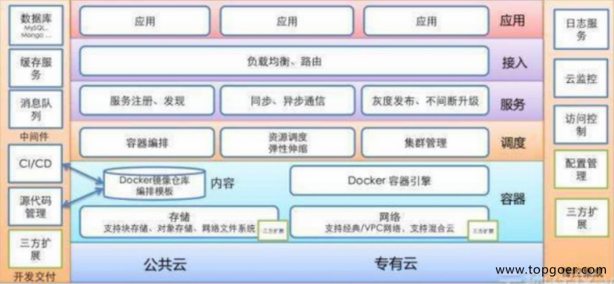
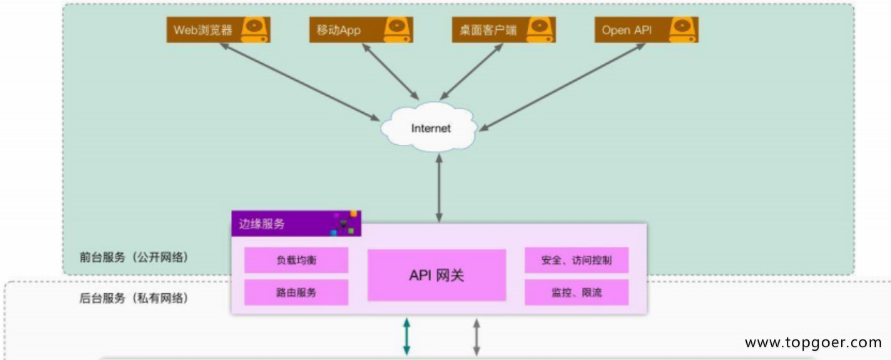
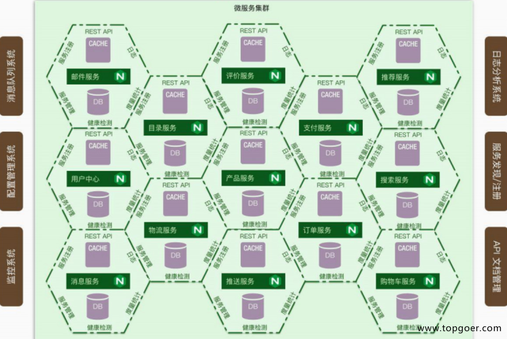

## 微服务实战
(带你十天轻松搞定 Go 微服务系列)[https://learnku.com/articles/64566]
## 微服务的概念
一套小服务来开发单个应用的方式，每个服务运行在独立的进程里，一般采用轻量级的通讯机制互联，并且它们可以通过自动化的方式部署

### 微服务特点
+ 单一职责，此时项目专注于登录和注册
+ 轻量级的通信，通信与平台和语言无关，http是轻量的，例如java的RMI属于重量的
+ 隔离性，数据隔离
+ 有自己的数据
+ 技术多样性

### 互联网架构演进之路

#### 单体架构
+ 所有功能放一个项目里
+ 应用和数据库服务器可能部在一起，分开部
+ 优点：简单，高效，小型项目
+ 缺点：扛不住,技术栈受限

#### 垂直架构
+ 将大项目架构拆分成一个一个单体架构
+ 优点：不至于像单体无限扩大
+ 缺点：有瓶颈,成本高

#### SOA架构，面向服务的编程
ESB，比较传统的中间件技术
优点：代码提高重用性，ESB接口解耦,针对不同服务，做不同数据层和部署
缺点：ESB比较重量级,对于开发人员来说，系统层和服务层界限模糊

#### 微服务架构
每个功能抽取成一个一个的服务,微服务之间访问是轻量级的，RPC

## 微服务生态
### 硬件层
用docker+k8s去解决

### 通信层
+ 网络传输，用RPC（远程过程调用）
    - HTTP传输，GET POST PUT DELETE
    - 基于TCP，更靠底层，RPC基于TCP，Dubbo（18年底改成支持各种语言），Grpc，Thrift

+ 需要知道调用谁，用服务注册和发现
+ 需要分布式数据同步：etcd，consul，zk

### 应用平台层

### 微服务层

## 微服务架构设计
#### 架构

#### 服务注册和服务发现
+ 客户端做，需要实现一套注册中心，记录服务地址，知道具体访问哪个，轮询算法去做，加权轮询
+ 服务端做，比较简单，服务端启动，自动注册即可

#### etcd
+ etcd解决分布式一致性，raft
+ etcd使用场景：注册发现；共享配置；分布式锁；leader选举

#### rpc调用和服务监控
RPC相关内容
+ 数据传输：JSON Protobuf thrift
+ 负载：随机算法 轮询 一致性hash 加权
+ 异常容错：健康检测 熔断 限流

服务监控
+ 日志收集
+ 打点采样

## RPC
远程过程调用（Remote Procedure Call，RPC）是一个计算机通信协议
该协议允许运行于一台计算机的程序调用另一台计算机的子程序，而程序员无需额外地为这个交互作用编程

### 例题入门
golang写RPC程序，必须符合4个基本条件，不然RPC用不了

+ 结构体字段首字母要大写，可以别人调用

+ 函数名必须首字母大写

+ 函数第一参数是接收参数，第二个参数是返回给客户端的参数，必须是指针类型

+ 函数还必须有一个返回值error

1. golang实现RPC程序，实现求矩形面积和周长
2. 模仿前面例题，自己实现RPC程序，服务端接收2个参数，可以做乘法运算，也可以做商和余数的运算，客户端进行传参和访问

### RPC调用流程
+ 微服务架构下数据交互一般是对内 RPC，对外 REST
+ 将业务按功能模块拆分到各个微服务，具有提高项目协作效率、降低模块耦合度、提高系统可用性等优点，但是开发门槛比较高，比如 RPC 框架的使用、后期的服务监控等工作
+ 一般情况下，我们会将功能代码在本地直接调用，微服务架构下，我们需要将这个函数作为单独的服务运行，客户端通过网络调用

###  网络传输数据格式
+ 两端要约定好数据包的格式
+ 成熟的RPC框架会有自定义传输协议，这里网络传输格式定义如下，前面是固定长度消息头，后面是变长消息体

#### 自定义网络传输协议

#### 实现RPC服务端

#### 实现RPC客户端

## Raft
Raft是consoul和etcd的核心算法

