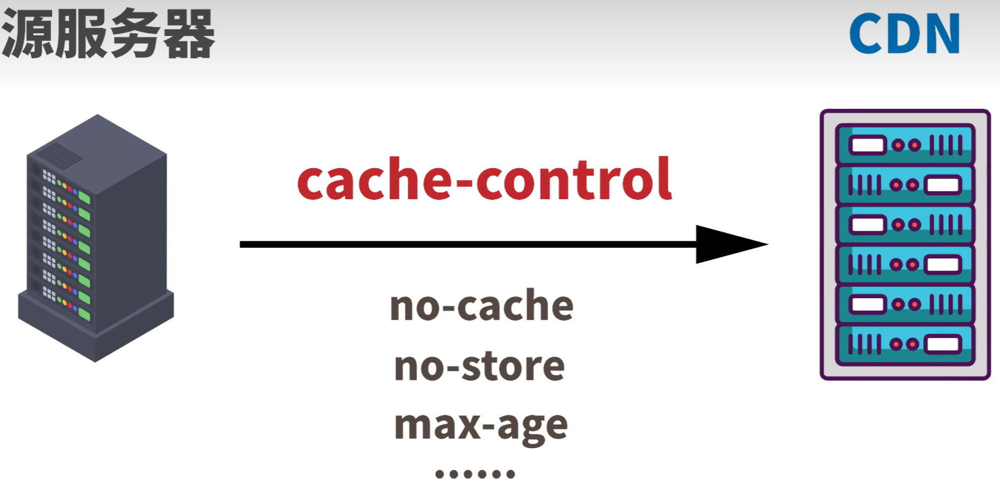
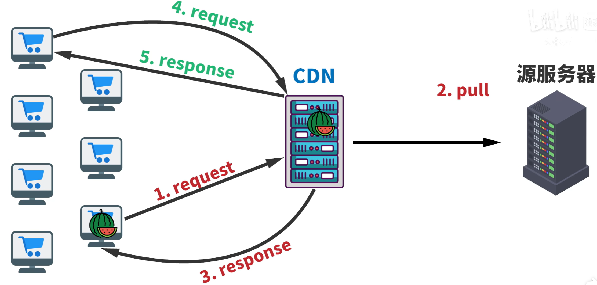
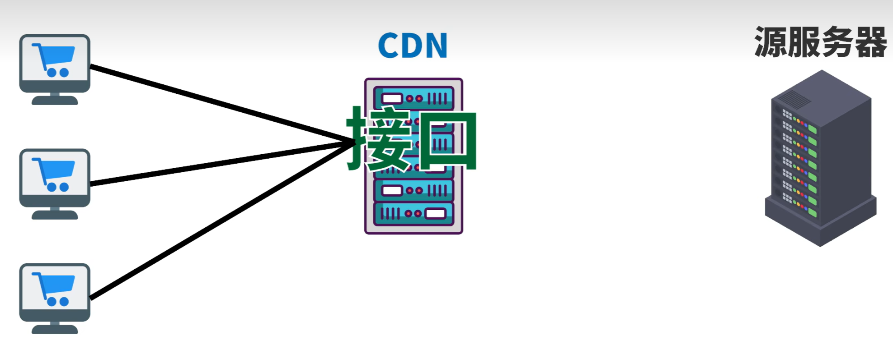

(什么是CDN？CDN能为我们做什么？我们为什么要了解他？)[https://www.bilibili.com/video/BV1jS4y197zi/?spm_id_from=333.337.search-card.all.click&vd_source=917ef87e48a267f0acc88f766dea0a6e]

## CDN(Content Delivery Network) 内容分发网络
## 什么是CDN？

这个网络有很多台边缘服务器提供服务，边缘服务器就是接近用户地这些服务器，CDN网络就是帮服务器近距离给用户分发网页内容的。

### 分发内容
1. 静态内容
静态内容就是图片、视频、音频、CSS、JavaScript等，这些内容在用户访问网站时，直接从源服务器上获取，该部分内容在长期上不需要改变， 但静态内容也不是一直保存在CDN服务器上。

2. 动态内容
有部分内容是动态生成的，需要经常改变的。比如用户登录后才能查看的页面，这些内容需要在用户访问时由源服务器生成，CDN网络可以缓存这些内容，当用户再次访问时，可以直接从缓存中获取，减少源服务器的负载。

源服务器发送文件给CDN时，可利用HTTP头部的cache-control，这个头部可设置文件的缓存形式，CDN知道哪些资源可以保存，哪些不能，哪些保存多久。

CDN分发的流程：
CDN没有网站上的源内容，源服务器会将静态内容提前备份给CDN上。世界各地需要访问网页的时候，就近的CDN服务器会把静态内容提供给客户(push)，不需要每次劳烦服务器，若源服务器没有把静态内容提前备份给CDN，

如果源服务器没有把静态内容提前备份给CDN，当用户访问网页的时候，CDN就会向源服务器请求索取静态内容(pull)，源服务器会将静态内容发送给CDN进行备份，CDN再将内容分发给用户。有了备份，其他同时做出请求的用户也可马上拿到内容

而动态内容是根据每个用户来改变的或根据时间来改变的，源服务器很难做到提前预测用户的动态内容，提前给CDN。如果等用户索取动态内容，CDN再问源服务器索取，这样CDN提供不了加速服务，也没有存在的意义了。但确实有部分动态内容，比如时间，因此有些CDN会提供可运行在CDN上的接口，让源服务器用这些接口，而不是源服务器自己的代码。这样用户可直接从CDN上获取时间，而不是从源服务器上获取.

用户不直接访问源服务器，而必须通过CDN进行沟通，不用担心恶意的DoS攻击，攻击CDN如果处理。布局CDN，进行监控CDN服务器的负载情况，如果有一台超载了，会把用户那边的请求转移到其他没有超载的CDN服务器上，以平均分配网络的流量，负载均衡.如何转移?

与DNS域名解析的里根服务器有着异曲同工之妙.任播技术:服务器对外都是同一个IP地址,请求由距离用户最近的服务器来响应.

负载均衡与任播之间紧密联系,CDN还会采用TLS/SSL证书给网站进行保护.

### CDN加速器
CDN会将文件进行最小化或压缩,节省不必要的字符;网络带宽费用高

